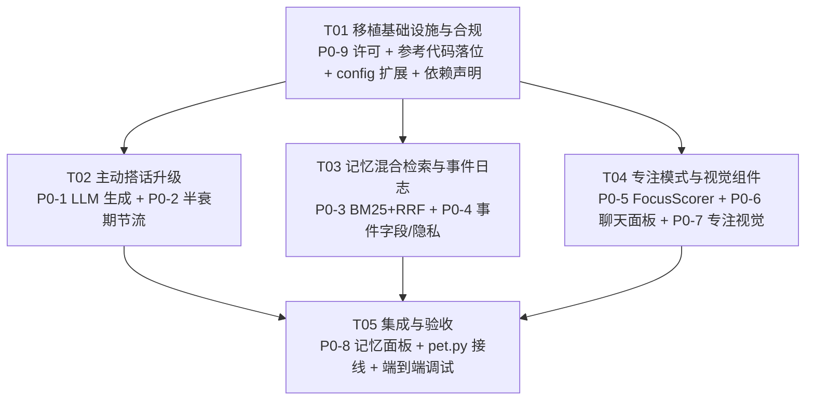

# N.E.K.O. → oc-pet 跨项目移植规划（架构师产出）

> 作者：架构师 Bob ｜ 日期：2026-08 ｜ 状态：待用户拍板
> 目标：把开源项目「N.E.K.O. 猫娘计划」的优秀功能/UI/美化移植到 oc-pet（PySide6 单体桌宠）。
> 约束：oc-pet 是 PySide6 单体（threading + Qt Signal），N.E.K.O. 是 asyncio 服务 + React 前端。
> 原则：**N.E.K.O. 代码作为"设计参考/算法参考"，PySide6 重新实现为主**；纯算法/数据结构可整体搬（保留 Apache 2.0 版权头）；前端/服务必须重写。
> 约束：避免引入多线程 COM 风险模式（0x8001010D 历史）——所有 Qt/COM 调用走主线程信号。

---

## 0. 现状盘点（探查结论）

### oc-pet 已有（移植的"地基"，不是从零）
| 领域 | 现有实现 | 文件 |
|---|---|---|
| 主动搭话 | ProactiveScheduler：意图分类（时间/前台/活动/持续时长）+ 规则引擎 + 自适应冷却 + 每日上限 + 全屏抑制 + 打字抑制 + 场景回忆(D)/联想(E) | `core/perception/proactive.py`、`intent.py`、`scenarios.py` |
| 长期记忆 | CompanionMemory（JSON 计数摘要 + last_topic + streak）、EventStream（事件流雏形）、SceneMemory（场景表 + 标签匹配 + 联想） | `core/companion_memory.py`、`core/event_stream.py`、`core/scene_memory.py`、`core/memory_snapshot.py` |
| 感知 | TimePerception / EmotionStateMachine / ScreenPerception（截图轮询）/ EnhancedEnvironmentScanner / ForegroundWatcher / ActivityTracker / PhoneActivity | `core/perception/*`、`core/enhanced_environment.py`、`motion/*` |
| UI | ChatBubble（头顶气泡+打字机）、单行输入框、StatusHUD、AmadeusHUD、CRT 特效、HeartParticles、InkSubtitle、ActivityFeed、CollectionBook | `ui/*`、`pet_mixins/chat_mixin.py` |
| 对话 | conversation_engine（LLM+TTS+工具一体化，后台线程+代际打断）、harness_adapter（Hanako 通道） | `core/conversation_engine.py`、`core/harness_adapter.py` |
| 多宠 | PetManager 多窗口，每宠独立记忆文件 | `pet_manager.py`、`pet.py` |

### N.E.K.O. 可移植资产（探查结论）
| 领域 | 可移植资产 | 文件 | 可否直接搬 |
|---|---|---|---|
| 主动搭话 | 决策管线（reason_code/stage 词汇）、多源候选生成（CHAT/WEB/MUSIC/MEME/VISION）、半衰期节流、投递协议（prepare/feed/finish） | `main_logic/proactive_chat/{contracts,decisions,sources,generation,state,delivery}.py`、`main_logic/core/proactive.py` | 算法/状态机可搬；asyncio/HTTP 层重写 |
| 记忆 | BM25+余弦+RRF 混合召回、CJK 2/3-gram 分词、繁简折叠、EmbeddingService（本地 ONNX + fallback gate）、FactStore、反思引擎、anti_repeat | `memory/hybrid_recall.py`、`memory/script_fold.py`、`memory/embeddings.py`、`memory/facts.py`、`memory/reflection*`、`memory/anti_repeat.py` | 纯算法直接搬；ONNX 层参考重写 |
| 专注模式 | FocusScorer（关键词+节奏+情绪加权）、hysteresis 状态机 | `main_logic/activity/focus_scorer.py`、`main_logic/core/focus.py` | FocusScorer 纯函数直接搬 |
| UI | React 聊天设计语言：角色气泡（user/system/assistant/tool）、头像、时间戳、思考点动画、focus glow 呼吸辉光、浮动滚动条、textChunkReveal/bubbleFloat 动画 | `frontend/react-neko-chat/src/{MessageList,MessageBubble,ThinkingDots,TopicHintBubble,SmartTextBlock,useFocusGlow}.tsx`、`styles.css` | 只做设计语言参考，PySide6 重绘 |

---

## 1. 移植清单总览

### P0（高价值低风险，先做）

| # | 移植项 | 来源（N.E.K.O.） | 落点（oc-pet） | 实现方式 | 复杂度 | 理由 |
|---|---|---|---|---|---|---|
| P0-1 | 主动搭话 LLM 生成（模板池 → 候选生成 + LLM 决策是否开口） | `main_logic/proactive_chat/generation.py`（生成思路）、`decisions.py`（管线） | `core/perception/proactive.py`（升级）、新 `core/perception/proactive_generation.py`、新 `core/perception/proactive_contracts.py` | 参考重写（去 asyncio/HTTP，走 harness_adapter 同步/信号通道） | 中 | oc-pet 文案是固定模板池，N.E.K.O. 用"多源候选 + LLM 决策 + 生成"更活；这是"灵魂"的核心升级 |
| P0-2 | 半衰期节流 + 打扰成本状态机（可观测 reason_code/stage） | `main_logic/proactive_chat/state.py`（`_half_life_for`/`_source_skip_probability`）、`contracts.py`（reason 词汇） | 新 `core/perception/proactive_state.py` | 直接搬（纯数学/纯数据结构，保留 Apache 头） | 低 | 纯算法零依赖；把现有静态/自适应冷却升级为"硬跳过窗口 + 半衰期衰减"，被无视→拉长，回应→缩短，行为更自然 |
| P0-3 | BM25 混合检索（CJK 2/3-gram + RRF 融合） | `memory/hybrid_recall.py`、`memory/script_fold.py`、`memory/persona.py`（`_extract_keywords`） | 新 `core/memory_hybrid.py`、新 `core/memory_keywords.py`、升级 `core/scene_memory.py` | 直接搬（纯 Python，无 I/O 依赖，保留 Apache 头） | 低-中 | 纯算法搬成本最低收益最大：场景/事件检索从"标签精确匹配"升级为"关键词+语义混合"，中文友好（2/3-gram 无需 jieba） |
| P0-4 | 对话事件日志字段归一 + 隐私截断 | `memory/event_log.py`（字段规范思路）、`memory/recall_render.py` | 升级 `core/event_stream.py`、`core/companion_memory.py`、`core/memory_snapshot.py` | 参考重写 | 低 | oc-pet EventStream 已有雏形；补齐 scenario/intent/emotion/intensity/source 字段与"vision 不落文本"隐私规则，为记忆展示面板提供数据 |
| P0-5 | 专注模式状态机 + FocusScorer | `main_logic/activity/focus_scorer.py`（FocusScore 加权）、`main_logic/core/focus.py`（hysteresis） | 新 `core/perception/focus.py`、升级 `motion/behavior.py`、`pet_mixins/behavior_mixin.py` | FocusScorer 直接搬；状态机按 oc-pet threading 重写 | 低-中 | 纯打分函数直接搬；先有状态，P2 的专注视觉才有着落 |
| P0-6 | 聊天面板 UI（PySide6 原生重绘 N.E.K.O. React 设计语言） | `frontend/react-neko-chat/src/MessageList.tsx`、`MessageBubble.tsx`、`TopicHintBubble.tsx`、`styles.css`（设计 token：气泡角色色/头像/时间戳/浮动滚动条） | 新 `ui/chat_panel.py`、`ui/chat_message.py`、`ui/theme/neko.qss` | 参考重写（QWidget+QSS+QPropertyAnimation） | 中-高 | 用户明确要求；消息列表/气泡/头像/时间戳/滚动条全部可原生实现；**不引入 QWebEngine**，规避崩溃面 |
| P0-7 | 专注视觉（focus glow + 思考点动画） | `useFocusGlow.ts`、`styles.css` 中 `focus-glow-breathe`、`focus-thinking-dots`、`@keyframes focus-thinking-dot-pulse` | 新 `ui/focus_overlay.py`、`ui/chat_thinking_dots.py` | 参考重写（QPropertyAnimation 呼吸辉光；QTimer 三点脉冲） | 低-中 | 纯视觉；PySide6 动画系统直接表达 |
| P0-8 | 记忆展示面板（事件/场景/事实卡片） | React FullChatSurface 记忆区块思路、`memory/recall_render.py` | 新 `ui/memory_panel.py`、`ui/memory_card.py` | 参考重写 | 中 | 让用户"看得见"记忆，配合 P0-3/4 数据 |
| P0-9 | 许可合规（Apache 2.0 → AGPL 移植头保留） | N.E.K.O. 所有带 `# Copyright 2025-2026 Project N.E.K.O. Team` 头的文件 | 新 `docs/THIRD_PARTY_NOTICES.md`、新 `third_party_reference/neko/`（参考代码落位）、`LICENSE` 附录 | 直接搬（文件头保留） | 低 | 许可硬要求；任何直接搬运文件必须保留 Apache 2.0 版权头 |

### P1（中优先级）

| # | 移植项 | 来源（N.E.K.O.） | 落点（oc-pet） | 实现方式 | 复杂度 | 理由 |
|---|---|---|---|---|---|---|
| P1-1 | 向量嵌入层（本地 ONNX EmbeddingService 或远程 API） | `memory/embeddings.py` + `memory/_embeddings/`（lifecycle/hardware/profiles/schema） | 新 `core/vector/`（embeddings.py / profiles.py / schema.py）、`requirements.txt` 可选依赖 | 参考重写（onnxruntime 依赖 + fallback gate 思路直接搬） | 高 | 需用户拍板（见决策 2）；P0-3 的 cosine 路径预留接口，此处填实现 |
| P1-2 | 事实库 FactStore（写入去重 + 信号检测 + 提升） | `memory/facts.py`、`memory/evidence.py`、`memory/fact_dedup.py` | 新 `core/memory_facts.py`、接入 `core/conversation_engine.py` 后处理 | 参考重写（规模缩小到单机桌宠） | 高 | 记忆从"记住场景标签"飞跃到"记住事实"；依赖 LLM（Hanako 通道已有） |
| P1-3 | 反思/摘要引擎（事件流 → 每日/每周反思） | `memory/reflection/`、`memory/refine.py`、`memory/reflection.py` | 新 `core/memory_reflection.py`、升级 `core/scene_memory.py` | 参考重写 | 高 | 用 LLM 把事件流压成反思，替代简单计数摘要 |
| P1-4 | 多来源内容源（web/music/meme 可插拔 source） | `main_logic/proactive_chat/sources.py` + `utils/web_scraper/` | 新 `core/proactive_sources/`（source registry） | 参考重写（源适配器按 oc-pet 现有能力） | 中-高 | 主动搭话"有话题可聊"的来源；需用户拍板是否接 web 抓取 |
| P1-5 | 反重复 anti_repeat（BM25 近重复检测） | `memory/anti_repeat.py` | `core/perception/proactive_state.py` 内嵌 + `core/conversation_engine.py` 输出去重 | 直接搬（纯算法） | 中 | 主动搭话+回复去重，避免车轱辘话 |
| P1-6 | 屏幕/意图感知升级（窗口标题语义化 + 隐私分级） | `main_logic/activity/snapshot.py`、`system_signals.py`、`llm_enrichment.py` | 升级 `core/perception/screen.py`、`core/enhanced_environment.py` | 参考重写 | 中 | oc-pet 已有截图/窗口感知；升级为"结构化快照 + LLM 标注 + 隐私分级" |
| P1-7 | 角色卡（character card 展示） | `memory/persona/`（persona 卡片）思路 + React 角色卡区块 | 新 `ui/character_card.py`、接入 `core/character_package.py` 数据 | 参考重写 | 中 | 用户明确要的角色卡 |
| P1-8 | HUD 风格统一（N.E.K.O. 设计语言 → 现有 HUD 重上色） | `styles.css` 色彩 token、`common-ui-hud.js` 思路 | `ui/status_hud.py` + `ui/amadeus_hud.py` + `ui/theme/neko.qss` | 参考重写 | 低-中 | 视觉统一，成本低 |

### P2（低优先级或大工程）

| # | 移植项 | 来源（N.E.K.O.） | 落点（oc-pet） | 实现方式 | 复杂度 | 理由 |
|---|---|---|---|---|---|---|
| P2-1 | 流式输入（屏幕/音频实时流 + 热切换） | `main_logic/core/streaming.py` | 升级 `core/perception/screen.py` | 参考重写 | 高 | oc-pet 是轮询截图，实时流是大工程 |
| P2-2 | QWebEngine 嵌入方案（替代 P0-6 的可选路线） | `static/react/neko-chat/` 构建产物（neko-chat-window.iife.js） | 新 `ui/web_chat_host.py`（QWebEngineView） | 直接搬（构建产物） | 中-高（引入崩溃面） | 用户拍板项（见决策 1）；与 0x8001010D 历史冲突，默认不推荐 |
| P2-3 | 小游戏邀请（mini_game_invite） | `main_logic/proactive_chat/mini_game_invite.py` | 新 `core/games/` + ui | 参考重写 | 高 | 大工程 |
| P2-4 | 音乐推荐（music_recommendation） | `main_logic/proactive_chat/music_recommendation.py` + `music_playback.py` | 新 `core/music/` | 参考重写 | 高 | 依赖播放器集成 |
| P2-5 | 休息提醒（break_reminders） | `main_logic/proactive_chat/break_reminders.py` | 接入 `core/work/work.py` | 参考重写 | 中 | oc-pet 已有 break_reminder config，可升级 |
| P2-6 | Live2D 表情丰富度（对照 N.E.K.O. 表现机制 + master_emotion VA 读数） | `static/live2d/` 表现机制、`main_logic/activity/master_emotion.py` | `avatar/live2d_renderer.py` + `core/emotion_transitions.py` | 参考重写 | 高 | 需理解 live2d 参数映射；大工程 |
| P2-7 | 语音身份/音色（voice_identity） | `main_logic/voice_identity/`、`utils/voice_design.py` | `tts_provider/` | 参考重写 | 中 | 与 oc-pet TTS provider 已有能力重叠 |
| P2-8 | 云端同步/存档（cloudsave） | `utils/cloudsave_runtime/` | `core/save/` | 参考重写 | 高 | 大工程 |

---

## 2. 关键设计决策（需用户拍板）

### 决策 1：聊天 UI 方案 — PySide6 原生重绘 vs QWebEngine 嵌入 React
- **推荐：PySide6 原生重绘（P0-6）**。理由：
  - oc-pet 有 0x8001010D COM 崩溃历史；QWebEngine 引入 Chromium 子进程 + 渲染线程，与"PySide6 主线程约束"正面冲突，风险面大。
  - 消息列表/气泡/头像/时间戳/思考点/浮动滚动条/呼吸辉光全部可用 QWidget+QSS+QPropertyAnimation 表达，视觉可达 90% 以上还原。
  - 保持单体架构，不引入第二个前端栈。
- 备选：若未来要"完整富文本/表情包画廊/可交互卡片"级聊天，可评估 QWebEngine，但必须**独立子进程**（QProcess 起本地静态服务 + 独立窗口），不嵌入主窗口，崩溃面隔离。
- **拍板点**：确认走原生重绘（推荐）；是否允许未来加 QWebEngine 备选通道。

### 决策 2：记忆向量化 — 本地 ONNX vs 远程 API vs 先纯 BM25
- **推荐：分阶段**。P0 先纯 BM25+RRF（零新依赖，P0-3 已覆盖）；P1 引入本地 ONNX EmbeddingService（可选依赖 + fallback gate——抄 N.E.K.O. 的 disable 逻辑：onnxruntime 不可用/模型缺失/内存不足 → 自动降级纯 BM25）。远程 embedding API 作为第二选项（需联网 + key）。
- 参考 N.E.K.O. 事实：`memory/embeddings.py` 用本地 CPU ONNX 检索模型，fp16 压缩向量（256d ≈ 684 字符/条），~100-500MB 模型。
- **拍板点**：① 接受本地 ONNX 模型体积（~200-500MB）？② 接受 onnxruntime 依赖？③ 还是先用远程 API？

### 决策 3：主动搭话 LLM 生成的模型通道 — 复用 Hanako vs 新开直连
- **推荐：复用 Hanako 通道**（`core/harness_adapter.py` + `core/conversation_engine.py`）。oc-pet 已有完整的 Hanako WS/API adapter，加一个"proactive 生成"专用 prompt 模式即可；避免引入第二个 LLM 栈与第二份 key。
- 注意：proactive 生成应走**独立线程 + 信号回主线程**，不阻塞对话主链路；生成失败/超时回退模板池。
- **拍板点**：确认允许 proactive 复用 Hanako 会话（会占用一次模型调用额度/可能计费）。

### 决策 4：N.E.K.O. 参考代码落位 — 拷贝进仓库 vs 仅写移植笔记
- **推荐：拷贝进 `third_party_reference/neko/`（只读参考区）**。理由：直接搬的文件（P0-2/P0-3/P0-5 等）需要保留 Apache 2.0 版权头 + NOTICE 声明；AGPL 仓库内放 Apache 2.0 文件合法（Apache 2.0 允许再分发），但必须**头保留 + NOTICE 声明**；运行时代码必须是重写后的 oc-pet 代码。
- **拍板点**：确认拷贝范围（只拷贝实际引用的 ~15 个文件 vs 全量模块）；是否接受 `third_party_reference/` 目录进仓库（体积 ~2MB）。

### 决策 5：专注模式默认开关 + 视觉侵入度
- **推荐：默认关**（`config focus.enabled=false`）。开启后仅聊天面板边缘 + 气泡轻微呼吸辉光（不遮屏、不抢焦点）；视觉强度可调（`focus.glow_strength` 0~1）。
- 对齐用户"摸鱼模式视觉表现"需求：专注模式下主动搭话频率下降、视觉安静；摸鱼模式下保留现有活泼表现。
- **拍板点**：确认默认关 + 强度可调；专注模式是否联动"降低 proactive 频率"。

### 共享约束（无需拍板，工程师必须遵守）
- 所有 Qt/COM 调用（QMediaPlayer、QWebEngine、Live2D GL 上下文）只能在主线程；后台线程结果必须经 `Signal` 绕回。
- 所有新模块按 `agent_id` 分实例（记忆文件已如此）；进程级共享模块（embedding 服务、BM25 索引）做单例 + 读锁。
- 直接搬运的 N.E.K.O. 文件保留 `# Copyright 2025-2026 Project N.E.K.O. Team` 头，并在 `docs/THIRD_PARTY_NOTICES.md` 登记。

---

## 3. 任务依赖图（P0 各项）

### 文件级任务分解（实施任务，≤5 个）

**T01 移植基础设施与合规（P0-9）**
- 新建 `docs/THIRD_PARTY_NOTICES.md`（登记所有搬运文件 + Apache 2.0 版权头）
- 新建 `third_party_reference/neko/`（只读拷贝：`proactive_chat/contracts.py`、`proactive_chat/state.py`、`memory/hybrid_recall.py`、`memory/script_fold.py`、`main_logic/activity/focus_scorer.py`、`frontend/react-neko-chat/src/styles.css` 等，保留原版权头）
- 修改 `config.py` + `config.json`：新增 `focus`、`memory.vector`、`proactive.generation` 配置段
- 修改 `requirements.txt`：新增可选依赖注释（onnxruntime、portalocker 为 P1 预留）
- 修改 `LICENSE`：附录说明 Apache 2.0 参考代码再分发
- 依赖：无。优先级：P0。

**T02 主动搭话升级（P0-1 + P0-2）**
- 新建 `core/perception/proactive_contracts.py`（reason_code/stage 词汇，参考 `contracts.py` 直接搬）
- 新建 `core/perception/proactive_state.py`（半衰期节流：`_half_life_for`/`_source_skip_probability`，参考 `state.py` 直接搬 + 每日预算）
- 新建 `core/perception/proactive_generation.py`（LLM 候选生成 + 模板池回退，参考 `generation.py` 思路重写，走 harness_adapter）
- 修改 `core/perception/proactive.py`（升级 tick 管线：意图 → 生成 → 回忆 → 规则兜底；接入 ProactiveThrottle/Generator）
- 修改 `core/perception/__init__.py`（导出新类）
- 依赖：T01。优先级：P0。

**T03 记忆混合检索与事件日志（P0-3 + P0-4）**
- 新建 `core/memory_keywords.py`（CJK 2/3-gram 分词 + 繁简折叠，参考 `script_fold.py`/`_extract_keywords` 直接搬）
- 新建 `core/memory_hybrid.py`（BM25 + cosine + RRF，参考 `hybrid_recall.py` 直接搬；cosine 端留接口等 P1-1）
- 修改 `core/scene_memory.py`（`find_matching` 升级为 HybridMemoryRecall 检索）
- 修改 `core/event_stream.py`（字段归一：scenario/intent/emotion/intensity/source + 隐私截断）
- 修改 `core/companion_memory.py`（`record_event` 写入新字段）
- 依赖：T01。优先级：P0。

**T04 专注模式与视觉组件（P0-5 + P0-6 + P0-7）**
- 新建 `core/perception/focus.py`（FocusScorer 直接搬 + FocusStateMachine hysteresis 按 threading 重写）
- 修改 `motion/behavior.py`（新增 focus mode 状态）
- 修改 `pet_mixins/behavior_mixin.py`（专注模式行为切换：降 proactive 频率）
- 新建 `ui/chat_panel.py`（消息列表 + 自动滚动 + 浮动滚动条，参考 MessageList/MessageBubble 设计语言重绘）
- 新建 `ui/chat_message.py`（单条消息渲染：角色气泡/头像/时间戳）
- 新建 `ui/chat_thinking_dots.py`（三点脉冲动画，参考 ThinkingDots）
- 新建 `ui/focus_overlay.py`（呼吸辉光，参考 useFocusGlow + focus-glow-breathe）
- 新建 `ui/theme/neko.qss`（N.E.K.O. 设计 token：气泡角色色/圆角/阴影/字体）
- 依赖：T01。优先级：P0。

**T05 集成与验收（P0-8 + 接线 + 端到端调试）**
- 新建 `ui/memory_panel.py`、`ui/memory_card.py`（事件/场景/事实三类卡片）
- 修改 `pet_mixins/chat_mixin.py`（聊天面板入口：双击/快捷键打开、新消息实时追加）
- 修改 `pet.py`（接线：proactive 生成器注入、focus 状态机注入、memory_panel 数据源、chat_panel 与 bubble 并存）
- 修改 `ui/bubble.py`（气泡入场动画升级：bubbleFloat/textChunkReveal 风格）
- 修改 `ui/status_hud.py`（可选：N.E.K.O. 设计语言重上色，若时间不足可延至 P1-8）
- 依赖：T02、T03、T04。优先级：P0。

---

## 4. 验收标准（每个 P0 项）

| 移植项 | 验收方式 |
|---|---|
| P0-1 主动搭话 LLM 生成 | 运行 ≥2h，proactive 触发文案不再取自固定模板池，日志出现 `[proactive] generated via llm`；LLM 失败自动回退模板池（日志 `fallback`）；同一会话不重复触发（dedup 日志）。 |
| P0-2 半衰期节流 | 单元测试覆盖 `_half_life_for`/`_source_skip_probability`（对照 N.E.K.O. 数值：硬跳过窗口内 1.0，之后 0.5^(age/half_life)）；连续被无视触发间隔指数拉长（日志可见 cooldown 增长）；每日上限生效（达到即静默）。 |
| P0-3 BM25+RRF | 单元测试：构造 5 条中文场景，检索"深夜加班"经关键词路径命中 `late_night_work`；语义近但关键词不同的场景经 RRF 提升；无 embedding 时退化为 BM25-only 不报错（fallback gate）。 |
| P0-4 事件日志增强 | 运行 1 天（或回放历史事件）后 `~/.oc-pet/memory/<agent_id>.json` 事件含 scenario/intent/emotion/intensity/source 字段；隐私规则生效（source=vision 不落文本）；旧文件兼容加载不崩。 |
| P0-5 专注模式 | 单元测试 FocusScorer 三信号加权（关键词/节奏/情绪）；脆弱性关键词+复杂提问 → 专注进入（日志 `focus=on`）；hysteresis 进出阈值正确；`config focus.enabled=false` 时零行为（不注入、不写日志）。 |
| P0-6 聊天面板 | 打开聊天面板显示消息列表（user/assistant/system 三类气泡、头像、时间戳）；思考点动画；自动滚动到最新；新消息即时到达；light/dark 主题切换样式正确；`pip show PySide6-WebEngine` 未安装也能运行（无 QWebEngine 依赖）。 |
| P0-7 专注视觉 | 专注开启时聊天面板边缘呼吸辉光运行（QPropertyAnimation 状态 running，帧率可测）；关闭立即消失；`config focus.glow_strength=0` 时零视觉；思考点动画周期 ~1.8s。 |
| P0-8 记忆面板 | 面板显示事件/场景/事实三类卡片；数据来自真实 memory 文件（`~/.oc-pet/memory/`）；空数据显示占位文案；与 P0-3/4 联调通过。 |
| P0-9 合规 | `docs/THIRD_PARTY_NOTICES.md` 列出所有搬运文件与版权头；直接搬运文件保留 `# Copyright 2025-2026 Project N.E.K.O. Team` 头；`git grep -l "Project N.E.K.O"` 输出与 NOTICE 完全一致。 |

---

## 5. 风险与注意事项

1. **0x8001010D 崩溃历史**：proactive 生成/记忆向量化/记忆反思都涉及后台线程 → 一律经 `Signal` 回主线程操作 Qt/COM；onnxruntime 推理放独立线程池（可借鉴 `core/conversation_engine.py` 的 ThreadPoolExecutor 模式），C 扩展 import 保持主线程（沿用 main.py 的 OC_TRACE_IMPORTS 探针）。
2. **性能**：BM25 索引在内存做（千条规模零成本）；onnxruntime 推理 batch 限制 1-8 条，加超时（参考 N.E.K.O. `HYBRID_RECALL_TIME_BUDGET`）；向量写入异步（`config.py` 已有 async_config_saver 可复用）。
3. **多宠隔离**：所有记忆/专注/主动状态按 `agent_id` 分实例；embedding 服务进程级单例（N.E.K.O. `get_embedding_service` 模式）。
4. **许可边界**：只允许"直接搬"标记为**直接搬**的文件（纯算法/数据结构）；其余一律重写，避免 AGPL 与 Apache 2.0 头混乱。
5. **P0-6 与现有气泡的关系**：聊天面板与头顶气泡**并存**——气泡保留（轻交互/主动搭话），面板用于完整对话浏览；入口放右键菜单 + 快捷键。
