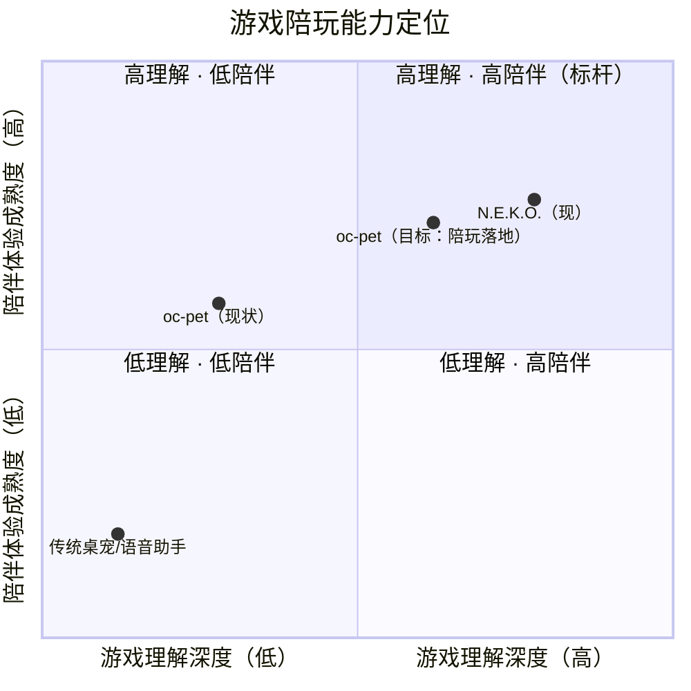

# oc-pet 陪玩游戏方向 · 市场差距分析（vs 猫娘计划 Project N.E.K.O.）

> 文档性质：未来方向规划（**非立即开发**）
> 作者：产品经理 许清楚（Alice）
> 日期：2026-08-16
> 版本：v0.1（评审稿）
>
> 对比对象：猫娘计划 Project N.E.K.O.（B站UP主 W博士/喵可智能，B站 AI 创造公开赛参赛作品，2026-01 上线 Steam，GitHub 2K+ star，Steam 用户过万）
> 参考素材：BV1Qcby6HEQ7（泰拉瑞亚猫娘陪玩）、BV1big36CEdp（红警猫娘副官）
> 核心问题：**"还有什么功能是对方比我们成熟的"** —— 以及这些差距对"陪玩游戏"方向意味着什么。

---

## 1. 结论速览（TL;DR）

- 在"陪玩游戏"方向上，N.E.K.O. 比我们成熟的功能集中在 **5 项**：游戏画面深度识别、游戏场景化文案池、主动搭话节奏控制、拟真 TTS + VoiceClone 音色克隆、A2A 智能体（副官"手脚"）。
- 其中 **前 3 项是陪玩刚需**，应作为补课第一梯队；VoiceClone 与 A2A 是拟真度/进阶能力，可分别后置到 P1 / P2。
- 我们的相对优势在 **P1 意图分类、P2 陪伴记忆、屏幕感知工程化、launcher 稳定性、本地隐私安全、多宠与换装** —— 这些是"长时陪伴不崩、不尬、不打扰"的地基，陪玩直接复用，成本低。
- 建议优先级：**P0 补「游戏状态感知 + 游戏文案池 + 播报节奏」→ P1 补「多游戏配置 + 游戏记忆 + VoiceClone」→ P2 再上「A2A 副官 + VRM/物理 + Steam/社区生态」**。

---

## 2. 能力对比总表

| # | 能力维度 | N.E.K.O. 成熟度 | oc-pet 现状（已核实代码） | 差距评级 |
|---|---------|----------------|--------------------------|:-------:|
| 1 | 游戏窗口识别 | 成熟：识别具体游戏进程/标题，感知启动/退出 | 前台分类有 `gaming`，但**无游戏白名单库、无启动/退出事件**（`motion/foreground_watcher.py` 只提供进程名/标题） | 🟡 黄 |
| 2 | 游戏画面深度识别（对局/战斗/胜负/剧情/资源） | 成熟：泰拉瑞亚观战吐槽、红警战局播报 | 仅 `entertain + gaming` 粗分类（`intent.py`，置信 0.9），**无游戏内状态机**；`screen.py` 视觉模型只返回 activity/category，不区分对局中/胜利/失败 | 🔴 红 |
| 3 | 场景化吐槽/加油文案池 | 成熟：社区共创（泰拉瑞亚/红警文案包），随状态触发 | 通用 5 模板（自由评论/好奇/鼓励/吐槽/关心，`screen.py _PROACTIVE_TEMPLATES`），**无游戏专属文案** | 🔴 红 |
| 4 | 主动搭话节奏控制 | 成熟："15-主动搭话"模块，节奏精细（打游戏安静、关键时刻搭话） | 20% 概率 + 5-15min 随机冷却（`screen.py _check_screen_proactive`），**规则粗糙、无对局内静默策略** | 🟡 黄 |
| 5 | 语音播报 | 拟真 TTS + **VoiceClone 少样本音色克隆** + 多语言 | Edge TTS / CosyVoice / Mimo（`tts_provider/`），**无音色克隆**，无"游戏状态→播报"链路 | 🟡 黄 |
| 6 | 情感标签实时映射表情 | 成熟：情感标签→表情实时映射 | `emotion_transitions.py` 已有，但粒度粗（关键词→情绪，`SCREEN_EMOTION_MAP`），无"胜利/失败/紧张"等游戏态表情 | 🟡 黄 |
| 7 | 物理反馈（发丝飘动/衣物垂坠/目光跟随） | 成熟（Live2D + VRM 双引擎） | 无；仅有 Live2D 基础渲染 + 视线跟随鼠标 | 🟡 黄（陪玩非刚需） |
| 8 | VRM 模型支持 | 成熟 | `avatar/vrm_renderer.py` 为**占位**（显示提示，未实现） | 🟡 黄（可暂缓） |
| 9 | A2A 智能体调用（副官执行） | 成熟：可调用通用 Agent（Hermes/OpenClaw 等）当"手脚" | 插件工具注册表（`plugins/linjian-peek`，`tool_executor.py` Node 子进程），**轻量、非通用 Agent 调用** | 🔴 红（副官刚需） |
| 10 | 记忆（游戏偏好/上次战局） | 独立记忆服务器：自动提取/分类/长期存储 | `CompanionMemory`（`core/companion_memory.py`）：记录常做事/上次话题/连续陪伴天数，**无游戏维度** | 🟡 黄 |
| 11 | Steam 发行 + 社区共创生态 | Steam 用户过万 + 社区共创系列 | 无发行渠道 | 🔴 红（生态，非功能） |
| 12 | 架构 | 分离式（UI / AI大脑 / 记忆 三独立） | 单体（`pet.py` god-object + 10 mixin，架构文档已承认技术债） | 🟡 黄（工程债，非用户功能） |

评级说明：🔴 红 = 对方成熟、我们缺/弱，且直接影响陪玩；🟡 黄 = 有差距但可通过复用/后置缓解；绿 = 持平或我方更强（见第 4 节）。

---

## 3. 对方成熟、我们缺/弱的功能 —— 按「差距大小 × 陪玩重要性」排序

| 排名 | 功能 | 差距大小 | 陪玩重要性 | 陪玩刚需？ | 说明 |
|:---:|------|:------:|:------:|:------:|------|
| 1 | **游戏画面深度识别** | 大 | 极高 | ✅ 刚需 | 陪玩的核心是"懂游戏里发生了什么"。我们只到"在玩游戏"，对方已到"懂战局" |
| 2 | **场景化吐槽/加油文案池** | 大 | 极高 | ✅ 刚需 | 没有游戏语境文案，"陪玩"就是尬聊；对方有社区共创内容护城河 |
| 3 | **主动搭话节奏控制** | 中 | 高 | ✅ 刚需 | 对局中乱说话是负体验；节奏控制决定陪玩是"加分"还是"打扰" |
| 4 | **语音播报（含 VoiceClone）** | 中 | 高 | 🟡 部分刚需 | TTS 播报本身是刚需（复用现有 Edge TTS 即可起步）；音色克隆是拟真加分项，可 P1 再做 |
| 5 | **A2A 智能体调用（副官执行）** | 大 | 中 | 🟡 可暂缓 | MVP 陪玩 = 吐槽 + 加油，不需要"手脚"；副官查攻略/执行指令是进阶，P2 |
| 6 | **游戏偏好记忆** | 中 | 中 | 🟡 可暂缓 | 在现有 CompanionMemory 上扩展即可，非 MVP 阻塞项 |
| 7 | **情感标签实时映射表情** | 中 | 中 | 🟡 可暂缓 | 现有 emotion_transitions 可先顶，细化到"胜利/失败"表情属体验增强 |
| 8 | **VRM 模型支持** | 中 | 低 | ⏸ 延后 | Live2D 初音已有，陪玩不依赖 3D |
| 9 | **物理反馈（发丝/衣物）** | 中 | 低 | ⏸ 延后 | 观感加分，非功能刚需 |
| 10 | **Steam 发行 / 社区生态** | 大 | 低（对当前） | ⏸ 延后 | 生态问题，不是功能问题，需单独规划 |
| 11 | **分离式架构** | 中 | 低 | ⏸ 延后 | 工程债，重构需单独立项，不应与陪玩功能捆绑 |

---

## 4. oc-pet 相对优势（诚实评估）

| 优势 | 现状（已核实代码） | 对陪玩方向的价值 |
|------|------------------|----------------|
| **P1 意图分类已实战** | 四维信号（时间/前台/活动/持续时长）→ 5 意图 + 10 场景，`gaming` 场景置信 0.9；深夜加班/长时工作休息等场景已有 | 陪玩不是无脑陪：能区分"娱乐该陪"vs"深夜该催睡"；深夜玩太久会触发休息提醒，反而比 N.E.K.O. 更懂节制 |
| **P2 陪伴记忆** | `CompanionMemory`：每日首启问候"你昨天说的X后来怎么样了"、连续陪伴天数、关电脑离别语 | 陪玩连续性："你昨天那个 boss 过了吗""上次打到哪了"——这是对方独立记忆服务器也未强调的**情感钩子** |
| **屏幕感知已工程化** | 变化检测（md5 帧对比跳过）、失败退避、敏感窗口黑名单、高斯模糊、关键词→情绪映射、5 种主动模板 | 游戏识别直接复用基础设施，不用从零搭；`on_foreground_change` 事件已能感知切窗 |
| **launcher 稳定性工程** | 自动复活、崩溃打包（`launcher.py`）、鼠标穿透（`WS_EX_TRANSPARENT`） | 长时游戏挂机不崩、不挡画面不抢焦点——是陪玩的基础体验，也是对方 Steam 版未公开强调的工程项 |
| **多宠打招呼 + 换装状态层（P3）** | `multi_pet_bridge.py` 社交事件；costume 自动装备 + 状态栏图标 | 未来可做"双人观战"：另一只宠上线一起看打游戏 |
| **本地隐私安全** | API key 全在 `.env`/`~/.hanako`，插件执行无 shell（`tool_executor.py`），截图可模糊 | 游戏内聊天/账号截图场景下更可信；`screen.py` 已有密码/支付黑名单机制可扩展 |
| **轻量单文件部署** | `main.py` + `launcher.py` 即起，无重型服务 | 相比对方"分离式三进程"架构，个人用户上手成本低 |

一句话总结优势：**对方赢在"游戏理解的深度"，我们赢在"陪伴体系的温度与稳定性"**。陪玩方向的正解是把两者结合——用我们的记忆/意图/稳定工程，去补对方的游戏理解能力。

---

## 5. 陪玩方向定位象限

解读：N.E.K.O. 占据右上（高理解 + 高陪伴）；我们现状在左上偏下（低理解 + 中高陪伴）；陪玩方向目标是把"游戏理解深度"从 0.28 拉到 0.62+，同时守住陪伴温度不降。

---

## 6. 结论：陪玩方向该补什么、优先级建议

| 优先级 | 补什么 | 关键依赖 / 复用 | 建议 |
|:---:|------|---------------|------|
| **P0（MVP 刚需）** | ① 游戏窗口识别（白名单 + 启动/退出事件） | 复用 `foreground_watcher` / `screen.py` 事件 | 先支持 3 款热门游戏（建议：原神类二次元大世界 / LOL 类 MOBA / 泰拉瑞亚类 Steam 单机） |
| | ② 游戏状态感知（对局中/等待/胜利/失败） | 复用视觉模型，新增状态机 + 快节奏采样（详见 PRD 待确认问题） | 准确率目标 ≥ 80%；可先用"窗口标题 + 视觉摘要"混合兜底 |
| | ③ 场景化吐槽/加油文案池（游戏类型 × 状态 → 文案） | 复用 `scenarios.py` 文案池机制 | 首发 3 款游戏 × 每款 ≥ 30 条；先内置模板，LLM 实时生成为 P1 |
| | ④ 语音播报链路（状态 → TTS 播报） | 复用 `tts_provider/`（Edge TTS 起步） | 必须带"静音/安静陪伴"开关；打断策略见 PRD 待确认问题 |
| | ⑤ 主动搭话节奏控制（对局中冷却、关键时刻触发） | 改造 `_check_screen_proactive` 的冷却/概率逻辑 | 这是陪玩体验的"生死线"，务必 P0 |
| **P1（体验增强）** | ⑥ 多游戏配置（游戏库管理、自定义文案/规则） | 复用 `config.py` / `settings_dialog` | 让用户自己加游戏，降低适配成本 |
| | ⑦ 游戏偏好记忆（常玩游戏/上次进度/胜负记录） | 扩展 `CompanionMemory` | 对接"你上次那个 boss 过了吗"的情感钩子 |
| | ⑧ 情绪→表情映射增强（胜利/失败/紧张） | 扩展 `emotion_transitions.py` + `procedural_emotion_frames` | 陪玩氛围感 |
| | ⑨ VoiceClone 音色克隆 | 技术预研（CosyVoice 已有本地基础） | 拟真度加分项，不阻塞 MVP |
| **P2（进阶/延后）** | ⑩ A2A 副官执行（查攻略/报战绩/简单指令） | 插件工具注册表升级为通用 Agent 调用 | 副官化是终局形态，但不应在 MVP 前做 |
| | ⑪ VRM 模型 + 物理反馈 | `avatar/factory.py` 已有渲染器抽象 | 观感升级，独立排期 |
| | ⑫ Steam 发行 + 社区共创文案包 | 需商业/法务/社区运营配套 | 生态问题，单独立项 |

**给团队的最终建议**：陪玩方向的差距不是"多做一个功能"，而是**把现有屏幕感知从"看懂屏幕"升级为"看懂游戏"，并把陪伴温度（记忆 + 节奏）产品化为游戏语境**。P0 五项全部落在现有架构可扩展的范围内，无颠覆性重构；真正的护城河（游戏文案 + 社区共创 + 副官执行）在 P1/P2，需提前在架构上留好扩展点（文案池可插拔、游戏库可配置、状态机可注册新游戏）。
