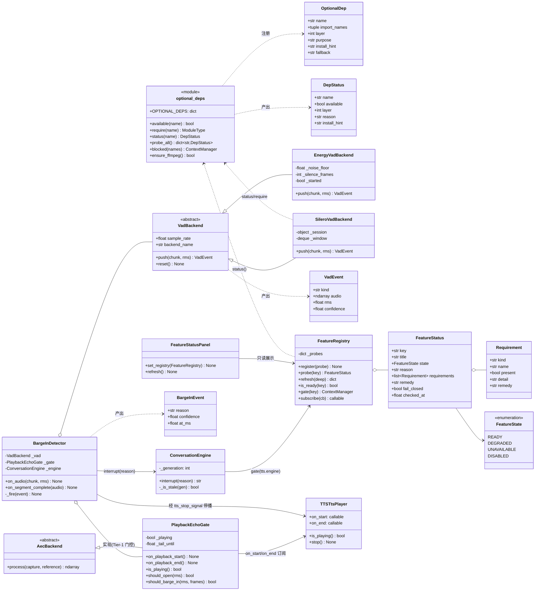
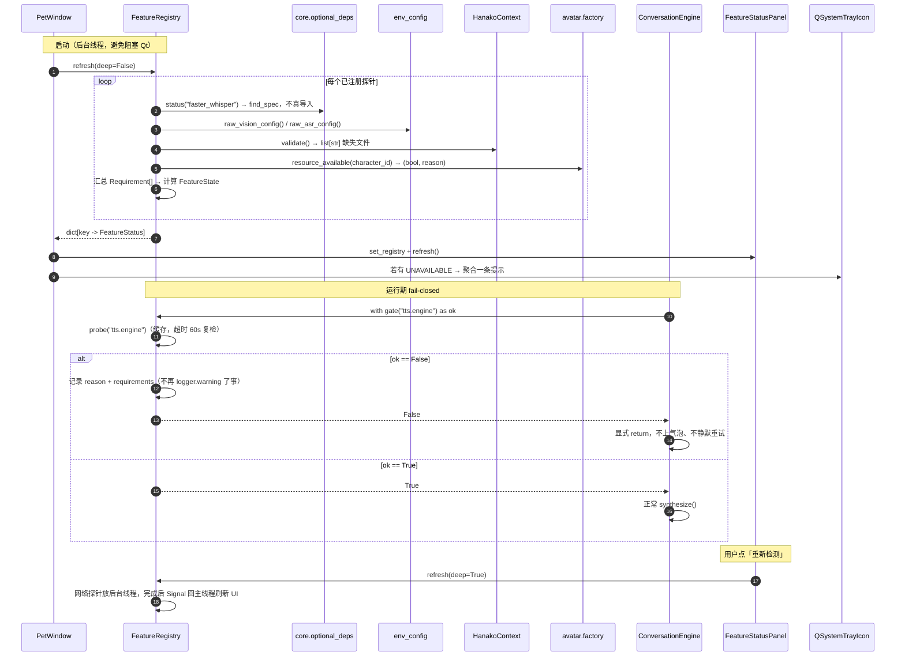
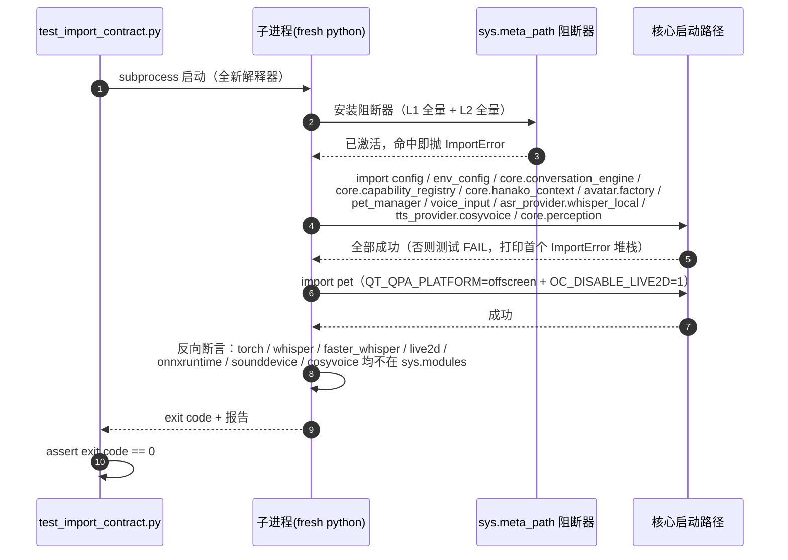
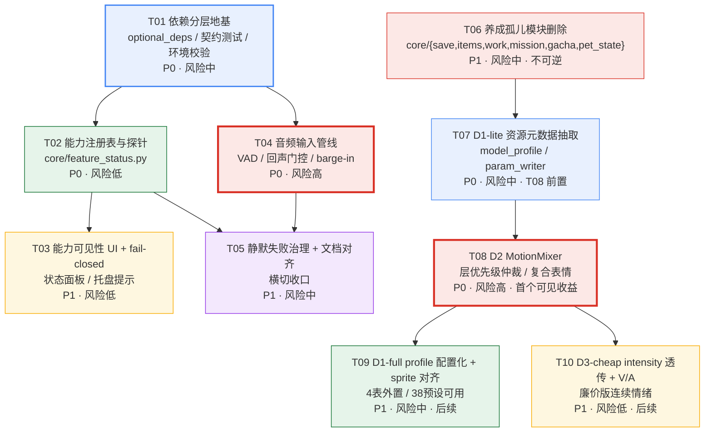

# oc-pet 增量架构设计（2026-09-03）

> 作者：高见远（架构师）
> 对象：`W:\Games\Hanako\Work\projects\oc-pet`（活代码，233 commits，自有代码 ~60,500 行 / 227 `.py`）
> 范围：**改造 A 依赖分层、改造 B 语音打断 + AEC、改造 C 能力可见性、改造 D Embody 层模型适配（D1）**
> 性质：增量设计，不含实现代码；不修改任何现有源文件
> 本轮**不做**：D2（MotionMixer）/ D3（VAD 连续情绪）—— 见 §1.4.8 后续接口预留

---

## 0.0 决策固化表（已拍板，不可降级）

> 本节是唯一权威。凡与本节冲突的表述（含 §8 旧「待明确」）一律以本节为准。

| # | 决策 | 落地位置 | 状态 |
|---|---|---|---|
| **一** | **用户以「持续监听」为主 → T04 维持 P0 且为全局最高优先级。不可降级、不可延后、不可裁剪。** | §5 T04 | ✅ 已固化 |
| **二** | **AEC 本轮只做 Tier-1 播放态门控；但后端必须可替换，为 Tier-2 预留接口。门控逻辑禁止硬编码进音频回调。** | §1.2.3.1 抽象边界 + T04 硬验收 | ✅ 已固化 |
| **三** | **VAD 走 `onnxruntime` 直跑 Silero ONNX 模型（**vendored `silero_vad_16k_op15.onnx` ≈2MB 或 `silero-vad --no-deps` 仅取模型文件**），主环境绝不 import `silero_vad` 包装、绝不引入 torch。PoC（§1.2.2.1 / `docs/poc-silero-vad-onnx-2026-09-04.md`）已 PASS，T04 可开工。** | §1.2.2 / §1.2.2.1 | ✅ 已固化 |
| **四** | **删除养成孤儿模块；`core/play/` 保留。** | §9 + T06 | ✅ 已固化 |
| **五** | **依赖声明走单文件四段式重排**（不拆 `requirements-optional.txt`） | §6.3 | ✅ 已固化 |
| **六** | **改造 D 优先级（已调和）：`D1-lite`（通道/资源元数据抽取，mixer 必需）→ `D2`（MotionMixer）→ `D1-full`（完整 profile 配置化 + sprite 对齐）→ `D3-cheap`（intensity 透传 + V/A 中间表示）。本轮先做 `D1-lite + D2`。** 调和依据：架构师「D1 先钉死通道层」是前置性论证，PM 价值论证（§1.4.9）用硬数据证明 D2 是用户可见的最高价值且「不改会继续恶化」；二者兼容 = D1-lite 作地基、D2 作首个可见收益。详证见 `docs/embody-value-case-2026-09-04.md` 与 §1.4.9。 | §1.4 + T07 + T08 | ✅ 已固化 |

### 0.0.1 三条「写死」的硬约束

1. **T04 优先级不可协商。** 持续监听是「桌宠听见自己」痛点唯一暴露的场景，barge-in 与回声门控的价值都建立在它之上。若日后产品形态转为「按住说话」，需**回到本文档修订本表**，不得在实施中单方面降级。
2. **Tier-1 的门控逻辑不得出现在音频回调线程。** 判据见 T04 验收：`core/audio_input/` 下除 `echo_gate.py` 外 `grep -rn "is_playing\|_tts_player"` 必须为空。
3. **主环境永不引入 torch。** Silero 走 onnxruntime；CosyVoice 走异仓库子进程。任何「顺手用一下 torch」的提议一律驳回。

---

## 0. 实地调研结论（先纠偏，再设计）

本节所有结论均由 Grep/Read 实地核实，标注了文件与行号。**其中 4 条与任务书描述不符，会影响方案选型，请优先看。**

### 0.1 与任务书不符之处（重要）

| # | 任务书描述 | 实地核实结果 | 影响 |
|---|---|---|---|
| 1 | CosyVoice 走独立 venv `.venv_cosy`（含 CUDA 版 torch） | **`.venv_cosy` 不存在**（`ls oc-pet/.venv*` 无结果）。真实模型是：①`COSYVOICE_DIR` 指向**另一个独立仓库** `W:/Games/Hanako/Work/projects/cosyvoice-tts`（已核实存在，含 `models/`）；②`tts_provider/cosyvoice.py:126-152` 的 `_resolve_worker_python()` **优先用主进程 `sys.executable`**（条件：`find_spec("torch")` 与 `find_spec("soundfile")` 均能定位——注意 `find_spec` 只定位不导入，是有意为之），仅当主环境缺 torch 时才回退 cosyvoice-tts 自带的 `venv/` `.venv/`（`_project_venv_python`，:116-123） | 隔离形态是「**异仓库 + 解释器选择**」，不是「项目内 venv」。这比任务书描述的更好，也说明**没有必要为 torch 引入 pip extras** |
| 2 | 可选依赖降级是「手工、不成体系」 | 部分是。核实结果：`torch / whisper / faster_whisper / onnxruntime / tokenizers` **在 oc-pet 自有代码中没有任何一处顶层 import**，全部已在使用点惰性导入。真正的缺陷是另外三个（见 0.2） | 不需要大规模改 import；工作量比预估小 |
| 3 | `_rebuild` 的 use-after-cleanup 是未修技术债 | **已修**。`pet_mixins/voice_provider_mixin.py:127-198` 已有代际号 `_tts_reload_gen` + 引用计数 `_tts_in_use` + `_defer_cleanup()`（:185-196，等待引用计数归零，上限 180s） | 本轮**不要重复修**，仅需补一个回归测试锁定 |
| 4 | pet.py 是 2950 行 / 11 个 mixin | 行数 2950 ✅（已核实 `wc -l`）。但 **pet.py:57-65 只 import 了 9 个 mixin**：`AudioMixin / GachaMixin / AnimationMixin / InteractionMixin / ChatMixin / BehaviorMixin / VoiceProviderMixin / PlayMixin / BubbleMixin`，类声明（:79）继承这 9 个 + QWidget。`pet_mixins/` 目录下 11 个 mixin 模块中，`nurturing_mixin.py` 与 `status_hud_mixin.py` **未被任何地方 import**。⚠️ **`pet.py:2840` 是一块误导性墓碑**：注释写着「状态指示器已迁移至 pet_mixins/status_hud_mixin.py（StatusHudMixin）」，但该文件**从未被 import**——功能要么没迁、要么已随 UI 移除。删除 `status_hud_mixin.py` 时必须一并清掉这行注释（见 T06） | 文档修正为「2950 行 / 9 个在用 mixin / 11 个 mixin 模块（2 个已孤儿）」。此项已经 team-lead 独立复核确认 |

### 0.2 依赖现状的真实问题（Grep 核实）

**已确认无任何顶层 import 的可选包**（全部惰性）：`torch`、`whisper`、`faster_whisper`、`onnxruntime`、`tokenizers`、`edge_tts`、`live2d`。

真实问题是这三条：

**（a）三个「用了但没声明」的包** —— 在任何 `requirements*.txt` 中都不存在：

| 包 | 使用位置 | 形态 |
|---|---|---|
| `imageio_ffmpeg` | `voice_input.py:19`、`asr_provider/whisper_local.py:17` | **import 时执行**（虽在 try 内） |
| `faster_whisper` | `voice_input.py:89`、`asr_provider/whisper_local.py:69` | 惰性 |
| `live2d-py` | `avatar/live2d_renderer.py:530, 555` | 惰性 |

**（b）import 期副作用 + 裸吞异常**：

```python
# voice_input.py:18-27 与 asr_provider/whisper_local.py:16-24（两处重复）
try:
    import imageio_ffmpeg
    _ffmpeg = imageio_ffmpeg.get_ffmpeg_exe()   # 执行外部二进制探测
    os.environ.setdefault('FFMPEG_BINARY', _ffmpeg)
    ...                                          # 改写进程级 PATH
except Exception:                                # ← 裸吞，历史上吞过真 bug
    pass
```
这段代码在模块导入瞬间执行、改写进程级 `PATH`、失败完全静默。

**（c）声明了但从未使用的包**：`portalocker`（`requirements.txt:32` 注释保留，全仓 `.py` 零引用，仅在 `third_party_reference/` 注释中出现）—— 死声明，应删。

**（d）另一处 import 期门控**（可保留但需统一）：`pet.py:70-75`
```python
try:
    from voice_input import VoiceInput, preload_whisper
    _voice_available = True
except ImportError:
    _voice_available = False
```

### 0.3 改造 B 现状（语音链路）

| 事实 | 位置 | 备注 |
|---|---|---|
| 能量 VAD 实际在 **chat_mixin**，不在 voice_input | `pet_mixins/chat_mixin.py:120-197` `_on_voice_vad` | voice_input 只提供 `set_vad_callback`(:323) / `peek_energy`(:319) |
| 阈值：自适应底噪 `max(0.02, nf*3.0)`，nf 用 `0.9*nf+0.1*rms` 递推 | `chat_mixin.py:135-141` | 仅在「未开始说话」态更新底噪 |
| 静音切分 40 帧 ≈1.3s；最短 0.5s；`Semaphore(2)` 限并发 ASR；5s 同句去重 | `chat_mixin.py:142, 164, 99, 183` | |
| **TTS 播放态对 VAD 零感知** | 全仓核实 | **这是「桌宠听见自己」的直接根因** |
| 播放态钩子**已存在** | `ui/tts_player.py:29-31`（`on_start/on_end/on_error`）、`:119-126`（`is_playing()`） | 直接可用，无需改播放器架构 |
| 跨线程停 TTS 的信号**已存在** | `pet.py:86-88` `tts_stop_signal` | 注释明确写了原因：QMediaPlayer 是 COM 组件，跨线程直调触发 `0x8001010D` |
| faster-whisper 分支**已启用** Silero VAD | `asr_provider/whisper_local.py:176` `vad_filter=True` | 但这是**转写段的 VAD 过滤**，不是端点检测；且只在 faster_whisper 分支生效 |
| 代际打断机制**已完整** | `core/conversation_engine.py:96-98`（`_generation`/`_current_gen`/`_interrupt_event`）、:427-475 `interrupt()`、:579-586 `_is_stale()`、三处检查点 :596 / :695 / :1000 / :1067 | `interrupt()` 已含：推进代际 + 清理非用户消息 + `session_manager.abort()` 真正取消 Hanako 侧 LLM |

**关键判断**：barge-in 的**下游作废链路已经建好且正确**。缺的只是「谁在什么时候触发它」——目前只有两个触发点：用户点麦克风（`chat_mixin.py:48`）、用户发消息（`chat_mixin.py:248`）。**不要另起炉灶。**

### 0.4 改造 C 现状（已存在的可复用资产）

| 资产 | 位置 | 复用方式 |
|---|---|---|
| **命名冲突源** | `core/capability_registry.py`（21,790 B）：`Capability` / `RouteResult` / `CapabilityRouter`(:177) | 这是**「文本 → 工具」路由器**，不是可用性注册表。改造 C **必须换名**，否则永久歧义 |
| 模型资源预校验 | `avatar/factory.py:127-171` `resource_available(character_id) -> (bool, reason)` | 已覆盖「Live2D 模型缺失」，直接吸收为探针 |
| 配置探针 | `env_config.py`：`get_tts_api_config`(:85) / `get_asr_api_config`(:112) / `get_vision_config`(:167) / `get_hanako_config`(:123) | 探针的天然数据源 |
| Hanako 完整性校验 | `core/hanako_context.py:451-470` `HanakoContext.validate() -> list[str]` | 已返回缺失文件清单，直接吸收 |
| 手机通道 | `core/perception/controller.py:104-113`（`PHONE_AUTH_TOKEN` 空 = 认证降级）；`core/phone_receiver.py:128`（`PHONE_RECEIVER_PORT`） | 「降级」与「不可用」需区分 |
| 设置面板结构 | `ui/settings_dialog.py`：主 `QTabWidget`(:52)，tab 添加于 :254 基础 / :584 功能 / :654 角色包 / :784 API；内部还有二级 `func_sub_tabs`(:263) | **已有两级 tab**，加一个顶层 tab 是低风险插入点 |
| 托盘提示 | `pet_manager.py:398-414` 已用 `QSystemTrayIcon.showMessage` 做启动失败气泡 | 可直接复用为「能力未就绪」聚合提示 |
| 已有验收/冒烟工具 | `scripts/feature_acceptance.py`（真实 PetWindow + 真实 Hanako）；`tests/test_real_startup_smoke.py`（offscreen Qt + 真实 PetWindow） | 已有一套 `OC_DISABLE_*` 环境变量开关词汇（:19-22 `OC_DISABLE_TRAY/PERCEPTION/LIVE2D` + `QT_QPA_PLATFORM=offscreen`），契约测试沿用 |

### 0.5 裸吞异常分布（供 T05）

`except Exception: pass` 高密度区：`voice_input.py:26`；`asr_provider/whisper_local.py:23`；`pet_mixins/chat_mixin.py:49, 233, 248, 261, 271, 283, 298`；`core/conversation_engine.py:642, 707, 721, 731`；`pet_mixins/voice_provider_mixin.py:152, 177`；`pet_manager.py:415`。历史事故（`_override` 漏定义导致整个程序化表情层静默失效）正源于此。

### 0.6 其他事实

- 项目**无打包元数据**（根目录无 `pyproject.toml` / `setup.py`），有 `oc_pet.spec`（PyInstaller）。用户工作流是「源码直跑 / 打包成 exe」，**没有 `pip install` 环节**。
- `config.py` 的 `DEFAULT_CONFIG["tts"]` **缺 `provider` 键**（调用点兜底 `"cosyvoice"`），而 `config.json` / `config.template.json` 实际为 `"edge"`。轻微不一致，建议在 T01 顺手补默认值。
- 实际运行配置：`tts.provider="edge"`、`asr.provider="whisper_local"`、`asr.backend="faster_whisper"`、`dialog.agent_id="ophelia"`。

### 0.7 改造 D 现状（Embody / Live2D 模型适配）与两处事实修正

> 以下为本次新增的实地核实。**其中 3 条推翻了立项时给定的背景描述，直接影响 D1 的价值论证，务必先看。**

#### 0.7.1 ✅ 已确认：语义参数抽象层真实存在

`avatar/live2d_renderer.py:84-120` 的 `_EMOTION_FACIAL_TARGETS` 定义 7 档情绪（neutral/happy/sad/angry/surprised/thinking/cute），每档 12 个语义参数：`eye_open`、`eye_smile`、`brow_angle`、`brow_form`、`mouth_form`、`mouth_open`、`eye_ball_x`、`eye_ball_y`、`head_angle_x`、`head_angle_y`、`breath_amp`、`breath_rate`。

**这是好消息，且是本轮 D1 的立足点**：D1 不是从零建抽象，**只差把「语义参数 → Cubism 原生 ID」的映射外置**。

`P = self._live2d.StandardParams`（:1236/1256/1326/1532/1714 处局部赋值），即写入用的都是 `live2d.v3.StandardParams` 上的常量。

#### 0.7.2 ✅ 已确认：映射硬编码，五项属性与 Soullink 的 `parameterMap` 一一对应

`live2d_renderer.py:1375-1440` 逐条写死（target / scale / weight / clamp / mode）：

| 语义通道 | Cubism 原生参数 | scale | weight | clamp |
|---|---|---|---|---|
| `eye_open` | `ParamEyeLOpen` / `ParamEyeROpen` | 1.0 | 0.5 | [0,1] |
| `eye_smile` | `ParamEyeLSmile` / `ParamEyeRSmile` | 1.0 | 0.6 | — |
| `brow_angle` | `ParamBrowLAngle` / `ParamBrowRAngle` | 1.0 | 0.6 | — |
| `brow_form` | `ParamBrowLForm` / `ParamBrowRForm` | 1.0 | 0.6 | — |
| `mouth_form` | `ParamMouthForm` | 1.0 | 0.6 | — |
| `mouth_open` | `ParamMouthOpenY` | 1.0 | 0.5 | [0,1] |
| `eye_ball_x` / `eye_ball_y` | `ParamEyeBallX` / `ParamEyeBallY` | 1.0 | 0.3 | — |
| `head_angle_x` | `ParamAngleX` | **15.0** | 0.35 | — |
| `head_angle_y` | `ParamAngleY` | **12.0** | 0.35 | — |
| `breath_amp` / `breath_rate` | `ParamBreath`（**正弦，非直写**） | 1.0 | 1.0 | amp[0,2] / rate[0.5,2.5] |

这五项正是 Soullink `parameterMap` 的 `target / mode / scale / min / max` 对应物。其中 `breath` 是 `mode: "sine"` 而非 `direct`，D1 的 schema 必须能表达这个差异。

#### 0.7.3 ✅ 已确认：静默 `except Exception: pass` 密集

`:1375-1440` 的**每一个**参数写入都包在裸 `try/except Exception: pass` 里（共 13 处）。与项目历史上「`_override` 漏定义被静默吞掉、导致整个程序化表情层失效」是同一个反模式。

#### 0.7.4 ⚠️ 修正一：**当前没有任何一个模型真的缺参数 —— 静默 except 尚未造成实际故障**

我扫描了仓库内全部可解析的 Cubism 元数据（`.cdi3.json`），与渲染器实际写入的参数集做差集：

| 角色 | `.cdi3.json` 参数总数 | 渲染器写入的 17 个参数中缺失 |
|---|---|---|
| `miku` | 226 | **0 / 17** |
| `sample_live2d`（Haru） | 69 | **0 / 17** |

**结论：D1 不是修 bug，是修「下一次接入模型时必然踩的坑」。**
这一点必须诚实地写进价值论证——**D1 的「缺失可见化」收益目前是 0，因为它要可见的那个问题今天还没发生。** 若把它包装成「修复了正在静默失效的功能」，是错误陈述。

#### 0.7.5 ⚠️ 修正二：**shizuku 是 Live2D 角色，不是精灵图；且它的模型根本没下载**

立项背景把 shizuku 描述为「精灵图侧情绪配置简陋」，实测两处不符：

| 项 | 立项描述 | 实测（`characters/shizuku/`） |
|---|---|---|
| 格式 | 精灵图 | **`"format": "live2d"` + `"style": "live2d"`**（`pet.json`），是**默认 Live2D 角色**（README 首行：「Shizuku — 默认 Live2D 模型角色包」） |
| `emotions` 项数 | 3 项（happy/surprised/thinking） | **6 项**（happy/surprised/thinking/sad/angry/neutral），全部映射到 `idle` |
| 模型本体 | — | **不存在**。`characters/shizuku/` 下只有 `pet.json` + `README.md`，**无 `live2d/` 目录、无 `.model3.json`**。README 明确写：「模型本体不随仓库分发，请按 README 下载放置」 |

推论：
- `emotions` 六项全指向 `idle` 不是「配置简陋」，而是**从精灵图模板复制过来后未清理的残留**（`animations` 也只有一个 `idle`，row 0 / 6 帧）。Live2D 角色根本不走 `animations`。
- **shizuku 今天处于「声明为 Live2D 但无模型」的状态**，渲染器侧已有一句防御注释（`live2d_renderer.py:2265-2266`：「防御：load() 失败的渲染器（`_model` 为 None，如占位角色无 live2d/ 目录）每帧仍被 tick 无条件调用本方法」）→ **静默 no-op，桌宠角色区域透明，用户看不出是「没下载模型」还是「程序坏了」。**

> **这条修正反而给了 D1 一个真实的当日收益**：D1 + 改造 C 联动后，「shizuku 缺 profile / 缺模型」会变成一个**可见状态**（`DEGRADED` + 「请按 README 下载模型」），而不是透明窗口。详见 §1.4.2。

#### 0.7.6 ✅ 已确认：模型专属特判散落多处

- `Param131`-`Param137`：miku 的比心/葱/唱歌/前倾贴图开关（`:1892`、`:2195`）
- `Param137` 水印抑制（`:684`、`:1144`、`:1219`）
- `_IGNORED_EXPRESSIONS` 水印/版权过滤（`:54`）

#### 0.7.7 ✅ 已确认：情绪档位不一致（渲染器 7 档 vs 监控器 8 档）

`core/hanako_monitor.py:268` `MOOD_EMOTION_PRIORITY` = `["angry","sad","surprised","happy","thinking","working","cute","missing"]`，比渲染器多出 **`working` / `missing`** 两档。`_EMOTION_FACIAL_TARGETS` 无这两档 → 静默回退。
**D1 不得修改任何已精调数值，因此本轮不处理这个缺口**，仅登记为 D2 输入（见 §1.4.8）。

#### 0.7.8 ✅ 已确认：`core/emotion_transitions.py` 与情绪语义无关

240 行，是 `TransitionEngine`，做单值 intensity 的 snap/fade/spring 平滑，经 `on_update` 回调喂给 `SpriteRenderer`。**D1 不应动它。**

#### 0.7.9 ✅ 已确认：`_ACTION_OVERLAYS` 是另一套字典（D2 范畴）

`live2d_renderer.py:129` 起，动作叠加字典（waving/happy/thinking/surprised/angry 等），与情绪目标叠加。`surprised` 里有 `"eye_open": 0.1` 这类**增量**语义，与 `_EMOTION_FACIAL_TARGETS` 的**绝对值**语义不同。**本次不动。**

#### 0.7.10 ⚠️ 修正三：`gacha_mixin` 的删除会级联出 816 行 UI 孤儿

立项背景只提到「`gacha_mixin` 被 `pet.py:58` import」。实测它是一条**依赖链的头**：

```
pet_mixins/gacha_mixin.py (114 行)
   ├─ from ui.gacha_reveal    → ui/gacha_reveal.py   (419 行)
   ├─ from ui.collection_book → ui/collection_book.py(288 行)
   └─ from ui.gacha_sound     → ui/gacha_sound.py    (109 行)
```

删除 `gacha_mixin` 后，这 3 个 UI 模块**全部变为孤儿**（`gacha_reveal` 仅剩 `collection_book` 引用其 `RARITY_THEME`；`collection_book` / `gacha_sound` 的外部引用只剩注释）。

**处置方案见 §9.4，需要拍板**：保守方案只删 mixin（114 行，零风险），彻底方案删整簇（**930 行**）。

---

## Part A：系统设计

## 1. 实现方案

### 1.1 改造 A：依赖分层

#### 1.1.1 结论：不照搬 Amadeus 的 pip extras，规范化现有「进程外隔离 + 惰性导入」模式

Amadeus 的 `pip install -e ".[voice,vad,local-cu124]"` 前提是「用户通过 pip 安装、有多种部署形态」。oc-pet 不满足：

| 维度 | Amadeus | oc-pet |
|---|---|---|
| 安装方式 | `pip install -e ".[extras]"` | 无打包元数据，源码直跑 / PyInstaller 打包 |
| 重型依赖位置 | 同一进程，靠 extras 决定装不装 | **已完全在进程外**（异仓库 `cosyvoice-tts` + 子进程 worker） |
| 用户 | 需按场景选型 | 单人、单机、单一形态 |
| 关键问题 | 「装哪个组合」 | 「哪些 import 会拖垮启动」 |

照搬 extras 的代价是**引入一层项目根本没有的打包机制**，却不解决真实问题（torch 已经不在进程内了）。

#### 1.1.2 方案：三层依赖模型 + 统一门控

| 层 | 内容 | 规则 |
|---|---|---|
| **L0 核心** | PySide6、numpy、requests、Pillow、PyYAML、pydantic、websocket-client + 启动路径上的全部自有模块 | **必须能在空可选环境下导入成功** |
| **L1 进程内可选** | sounddevice、soundfile、scipy、edge-tts、imageio-ffmpeg、faster-whisper、openai-whisper、onnxruntime、tokenizers、live2d-py | **只允许在使用点惰性导入**，经统一门控 |
| **L2 进程外重型** | torch、cosyvoice、funasr、modelscope | **oc-pet 进程永不 import**。只允许 `find_spec` 探测（沿用 `cosyvoice.py:144-150` 的既有做法） |

门控收敛到一个模块 `core/optional_deps.py`：

```
OPTIONAL_DEPS: dict[name -> OptionalDep]
OptionalDep = { import_names: tuple[str,...], layer: 1|2, purpose: str,
                install_hint: str, fallback: str }

available(name) -> bool        # find_spec 探测，永不真导入；结果进程内缓存
require(name)   -> module      # 真导入；失败抛 OptionalDependencyError
status(name)    -> DepStatus   # available + reason + layer + install_hint（供改造 C）
probe_all()     -> dict
blocked(names)  -> ContextManager   # 仅供契约测试：装 meta_path 拦截器
```

**为什么这比 extras 强（三条硬理由）**：
1. 用户现有单 venv 直接受益，不需要重跑 pip，也不引入打包层；
2. 与 PyInstaller 打包兼容（extras 在打包场景下无意义）；
3. **`status()` 直接喂养改造 C** —— 「Needs setup」面板的每一行就是 `optional_deps.status()` + 若干环境探针的组合。extras 做不到这点。

#### 1.1.3 导入契约测试

沿用 Amadeus 思路，但适配形态：

- **必须子进程执行**（`python -X importtime` 或 `subprocess` 起全新解释器）。原因：阻断器必须装在 `sys.meta_path` 最前面、且在首次 import 之前；进程内做会污染 `sys.modules`，断言失真。
- **阻断集** = L1 全量 + L2 全量：
  `sounddevice, soundfile, scipy, edge_tts, imageio_ffmpeg, faster_whisper, whisper, onnxruntime, tokenizers, live2d, torch, cosyvoice, funasr, modelscope`
- **核心启动路径断言**（阻断生效下必须全部 import 成功）：
  ```
  config, env_config, core.conversation_engine, core.capability_registry,
  core.hanako_context, avatar.factory, pet_manager, voice_input,
  asr_provider.whisper_local, tts_provider.cosyvoice, core.perception
  ```
  以及 `import pet`（需 `QT_QPA_PLATFORM=offscreen` + `OC_DISABLE_LIVE2D=1`，沿用 `test_real_startup_smoke.py:19-22`）
- **反向断言（防回归的关键）**：跑完后断言 `torch / whisper / faster_whisper / live2d / onnxruntime / sounddevice / cosyvoice` **均不在 `sys.modules` 中**。这条能抓住「有人又把重依赖挪回顶层」。

#### 1.1.4 `verify_environment.py --profile`

需要，但与契约测试是两件事：

| 工具 | 性质 | 时机 |
|---|---|---|
| `tests/test_import_contract.py` | **阻断**可选包，证明核心路径不依赖它们 | CI / 改动后 |
| `scripts/verify_environment.py --profile` | **探测真实环境**有哪些、打印能力状态表 | 用户排查 / 提交 issue 时 |

profile：`core | voice | local-tts | live2d | all`。输出 L1/L2 包状态表 + 改造 C 的能力探测结果（复用 `FeatureRegistry`），可直接粘贴到 issue。**注意：`local-tts` profile 只做 `find_spec` 探测和 `cosyvoice.py` 的目录/解释器解析，绝不 import torch。**

#### 1.1.5 需要修改的具体位置（Grep 核实，非空列）

| 文件:行 | 现状 | 改法 |
|---|---|---|
| `voice_input.py:18-27` | import 期执行 `imageio_ffmpeg.get_ffmpeg_exe()` + 改写 PATH + 裸吞 | 抽成 `_ensure_ffmpeg()`，由 `_get_whisper_model()` / `start()` 惰性调用；异常改 `logger.debug` |
| `asr_provider/whisper_local.py:16-24` | 同上（重复代码） | 同上，与 voice_input 共用 `core/optional_deps` 的 ffmpeg 助手 |
| `pet.py:70-75` | 模块级 `try/except ImportError` 设 `_voice_available` | 改为 `optional_deps.available("sounddevice")`，并登记失败原因 |
| `core/hanako_ws_client.py:23` | 顶层 `import websocket` | 改惰性 + 门控（Hanako 未安装时不该需要该包） |
| `requirements.txt` | 缺 imageio-ffmpeg / faster-whisper / live2d-py；portalocker 是死声明 | 见 §6 |

> `core/perception/screen.py:28` 顶层 `from PIL import ImageGrab`：Pillow 是 L0，可保留；但截图是能力，建议一并惰性化，让「不开屏幕感知」的环境少一个依赖。**列为可选优化，不阻塞。**

### 1.2 改造 B：语音打断 + AEC

#### 1.2.1 总体思路

一句话：**把「端点检测」抽成可替换后端，把「回声」用播放态门控解决，把「barge-in」做成现有 `engine.interrupt()` 的新触发源。**

三个组件，职责严格分离：

1. **VAD 抽象**（`vad.py`）—— 决定「哪里是人声」。
2. **回声门控**（`echo_gate.py`）—— 决定「现在听到的算不算数」。
3. **Barge-in 判定**（`barge_in.py`）—— 决定「什么时候调用已有的 interrupt」。

#### 1.2.2 VAD：双后端，无 torch 依赖

```
VadBackend(ABC)
  ├─ EnergyVadBackend      # 逐行移植 chat_mixin.py:120-197 的现有逻辑
  └─ SileroVadBackend      # 可选；走 onnxruntime
create_vad(preferred="auto") -> VadBackend   # auto = silero 可用则用，否则 energy
```

**EnergyVadBackend 必须逐行等价移植**（自适应底噪 `0.9*nf+0.1*rms`、阈值 `max(0.02, nf*3.0)`、40 帧静音、0.5s 最短、Semaphore(2)、5s 去重）。理由：这是纯重构，行为不能变，否则无法验证「降级路径 == 今天的体验」。

**Silero 走哪条路 —— 关键取舍**：

| 方案 | 依赖 | 体积 | 评价 |
|---|---|---|---|
| **A. Silero ONNX + onnxruntime**（推荐） | `onnxruntime`（CPU 版 ~15-45MB），模型取 `silero_vad_16k_op15.onnx`（vendored ≈2MB，或 `pip install silero-vad --no-deps` 后取包内 `data/*.onnx`） | 小 | **不引入 torch、不 import `silero_vad` 包装**（其包装层是 torch 写的，PoC 实测 `import` 即报 `ModuleNotFoundError: torch`） |
| B. silero-vad + torch | torch（~2.5GB，CUDA 版更大） | 巨大 | 直接违背「主环境不含 torch」的既定方向 |
| C. 纯能量（现状） | 无 | 0 | 保留为降级路径 |

**决策三（已拍板）：走 A（onnxruntime 直跑 Silero ONNX，vendored 模型或 `silero-vad --no-deps` 仅取模型文件），主环境绝不 import `silero_vad` 包装、绝不引入 torch。**
`--no-deps` / vendored 是强制项：`silero-vad` 的 Python 包装层是 torch 写的（PoC 实测 `import silero_vad` 报 `ModuleNotFoundError: torch`），故运行时必须 onnxruntime 直跑 ONNX，而不是调用其 API。详见 `docs/poc-silero-vad-onnx-2026-09-04.md`。

#### 1.2.2.1 PoC 前置门禁（**决策三：PoC 通过才允许开工 T04**）

`silero-vad` 的非 torch 路径**未经本项目实测**（其官方示例默认走 torch），因此设为一道硬门禁，由工程师在隔离 venv 中验证。

> **PoC 已执行（2026-09-04）**：架构/工程子代理当时受 429 限流，由 team-lead 直接执行于隔离 venv（managed python 3.13 + `envs/silero-poc`）。完整记录见 **`docs/poc-silero-vad-onnx-2026-09-04.md`**。

| 项 | 内容 |
|---|---|
| 执行者 | team-lead 直接执行（子代理限流） |
| 环境 | **隔离 venv**：`pip install --no-deps onnxruntime silero-vad` → `onnxruntime-1.29.0` + `silero-vad-6.2.1`，`torch` 确认未引入 |
| 通过判据（已根据实测修正） | ①`pip list` 中**无 torch**；②能加载 `silero_vad_16k_op15.onnx` 并完成 `session.run`（**注意：`import silero_vad` 本身会 `ModuleNotFoundError: torch`——包装层是 torch 写的，故「用其 API」不可行，必须 onnxruntime 直跑 ONNX**，此点与原始判据①相反，属预期且可接受）；③16kHz/512 样本窗**单次推理 0.16ms（< 5ms 阈值，余量 30×）** |
| **门禁结果** | **PASS（带一项待补）**：无 torch 集成路径可行且极廉价；待补项为「检测准确率需在真实语音上复测」（沙箱无外网、Silero 对合成信号天然判非语音，见报告 §2.4）。**不阻塞 T04 开工**——推理链路已验证、能量 VAD 作为回退通道不变。 |

**T04 据此调整**：VAD 抽象层采用「vendored ONNX（`silero_vad_16k_op15.onnx`，≈2MB）+ 自写 onnxruntime 迭代器（报告 §4）」，**不再 `import silero_vad` 包**。`onnxruntime` 为唯一新增运行时依赖；若选择 vendored ONNX，则连 `silero-vad` 这个 pip 包都不必装，torch 风险彻底归零。

**回退方案 B（触发条件：PoC 未通过）**：

- **改动范围**：`core/audio_input/vad.py` 内**不实现** `SileroVadBackend`（保留 ABC 与 `create_vad()`，后者恒返回 `EnergyVadBackend` 并 `logger.info` 说明原因）；`echo_gate.py` / `barge_in.py` / `ring_buffer.py` / `chat_mixin.py` / `pet.py` **全部不受影响，照原计划实施**；`requirements.txt` 不新增 `silero-vad`，`onnxruntime` 维持注释状态。
- **能力损失**：仅端点检测精度（嘈杂环境下可能多切/少切）。**「听见自己」与「打断」两个核心痛点由回声门控与 barge-in 解决，与 VAD 后端无关，不受影响。**
- **这是可接受的结果**：本项目设计上就把 Silero 定位为「增强项」而非「依赖项」，抽象层正是为此存在的。

#### 1.2.3 AEC：明确的取舍与建议

先说结论：**不建议在本轮做「真 AEC」。建议做 Tier-1 播放态门控，Tier-2 真 AEC 列为待定。**

**为什么 scipy 不够**：
- 现有依赖确实有 `scipy`（`requirements.txt:11`），`scipy.signal` 有 `fftconvolve` / `lfilter`，理论上能写 NLMS 自适应滤波（~80 行）。
- **但 AEC 的前提是拿到「参考信号」（播放端采样）**。`sounddevice` 在 Windows 上给不了捕获端与渲染端**采样级对齐**的参考流；没有 loopback 通道就无法相关。
- 渲染时钟与捕获时钟存在漂移，不做连续重采样的 NLMS 几秒内发散。
- 结论：**scipy 不解决参考信号问题**。缺的不是滤波器，是参考流。

**Tier-1：播放态门控（本轮做，无新依赖）**

利用已存在的 `TTSTtsPlayer.on_start / on_end / is_playing()`：

```
宠物说话中（on_start → on_end + 尾部保护 300ms）：
  ├─ 抬高 VAD 起始阈值（×N）→ 自己的声音打不开新的语音段      ← 解决「听见自己」
  └─ 保留「barge-in 窗口」：RMS 超过更高阈值且持续 M 帧
        → 判定为用户插话 → 触发 barge-in                      ← 解决「打断」
尾部保护：on_end 后 250-400ms 继续抑制（覆盖播放缓冲/驱动延迟）
```

一个机制同时解决两个痛点，这是本方案的核心价值。

#### 1.2.3.1 抽象边界与替换点（**决策二：Tier-1 落地，但必须可替换为 Tier-2**）

用户已确认「最终目标是真 AEC，本次只落地 Tier-1」。因此 Tier-1 的**硬约束**是：
**门控逻辑不得硬编码进音频回调线程**，必须全部收在 `EchoSuppressor` 抽象之后，使后续替换 Tier-2 时**调用点零改动**。

**抽象边界（唯一的稳定接口）**：

```python
class EchoSuppressor(ABC):
    """回声抑制抽象。Tier-1 = 门控；Tier-2 = 自适应滤波。

    ★ 这是 Tier-1 → Tier-2 的唯一替换点。除本类内部实现外，
      任何调用点都不得感知当前用的是哪一层。
    """
    @abstractmethod
    def on_playback_start(self) -> None: ...   # 订阅 TTSTtsPlayer.on_start
    @abstractmethod
    def on_playback_end(self) -> None: ...     # 订阅 TTSTtsPlayer.on_end
    @abstractmethod
    def is_speaking(self) -> bool: ...
    @abstractmethod
    def should_open(self, rms: float) -> bool: ...
    @abstractmethod
    def should_barge_in(self, rms: float, frames: int) -> bool: ...

    # ── Tier-2 预留：Tier-1 返回原样输入即可，签名先行锁定 ──
    def process(self, capture: np.ndarray, reference: np.ndarray | None) -> np.ndarray:
        """Tier-2 时做自适应滤波；Tier-1 直通返回 capture。"""
        return capture

class PlaybackGateSuppressor(EchoSuppressor):   # Tier-1，本轮实现
    ...
class AecFilterSuppressor(EchoSuppressor):      # Tier-2，本轮只留空类 + 文档，不实现
    ...
```

**三条不可违反的边界规则**（写进 T04 验收）：

1. **音频回调线程只调用 `EchoSuppressor` 的方法**，不得出现 `if self._tts_player.is_playing():` 这类直接判读播放态的代码。判据：`core/audio_input/` 下除 `echo_gate.py` 外，`grep -rn "is_playing\|_tts_player"` 必须为空。
2. **`process()` 的签名现在就锁定**（接受 `reference: ndarray | None`），即使 Tier-1 忽略它。这样 Tier-2 接入时只需换实现、加一路 loopback 采集，不改调用点。
3. **`create_suppressor()` 工厂按配置选择实现**：`asr.vad.aec.backend = "gate" | "aec"`，默认 `"gate"`。配置键现在就定义好，避免 Tier-2 时再改配置 schema。

**Tier-2 落地时的改动范围**（预先声明，便于评估）：新增 `soundcard` 依赖 + `AecFilterSuppressor` 实现 + 一路 WASAPI loopback 采集线程；`vad.py` / `barge_in.py` / `chat_mixin.py` / `pet.py` **均不需改动**。

**Tier-2：真 AEC（本轮 deferred，接口已预留）**

需要参考流，两条路：
- `soundcard`（纯 Python + cffi，**无 torch**）提供 WASAPI loopback → 拿到真实渲染流 → 再用 scipy/numpy 写 NLMS；
- 或 `speexdsp` / `webrtc-audioprocessing` 的 Python 绑定，内置成熟 AEC。

代价：新增音频设备依赖、Windows WASAPI 设备枚举坑、需实测调参。收益仅覆盖「用户以正常音量在宠物说话时插话」这一 Tier-1 已部分覆盖的场景。**建议先上 Tier-1，用一段时间再决定。**

#### 1.2.4 Barge-in：与代际机制融合，不另起炉灶

**现状盘点**（`conversation_engine.py`）：

| 已有能力 | 位置 |
|---|---|
| 代际计数 `_generation` | :96, 在 `send()`(:412) / `interrupt()`(:453) 递增 |
| 打断信号 `_interrupt_event` | :98 |
| 过期判定 `_is_stale(gen)` | :579-586 |
| 三处作废检查点 | :596（入队后）、:695（LLM 后）、:1000（TTS 前）、:1067（TTS 后） |
| 取消 Hanako 侧 LLM | :465-472 `session_manager.abort()` |
| 队列清理（保留用户消息） | :460-463 |

**这套已经正确且完整。BargeInDetector 唯一职责：决定何时调用 `engine.interrupt(reason="voice_start")`**，然后：
1. `interrupt()` 推进代际 → 三处 `_is_stale` 自动作废 LLM/TTS 结果；
2. `interrupt()` 调 `abort()` → Hanako 侧停止思考；
3. 物理播放的停止：detector 额外 emit `tts_stop_signal`（已存在于 `pet.py:88`）→ 主线程 `stop()`。

**第 3 点是现状遗漏**：目前没有打断路径会去停正在播放的 `QMediaPlayer`，只有 `_send_message`(:244) 和 `_toggle_voice`(:51) 在调用点手动 `self._tts_player.stop()`。BargeInDetector 必须补上，且必须走信号（COM 跨线程限制，见 `pet.py:86-88` 注释）。

**判定规则**（避免误触发）：
```
用户语音段起始 且（宠物正在播放 TTS 或 引擎正在思考）：
    若 持续帧数 >= M 且 RMS >= barge_in_threshold
      → BargeInEvent(reason="voice_start", confidence)
抑制窗口：on_end 后 300ms 内的起始不计为 barge-in（自己的尾音）
```

#### 1.2.5 新增配置

```jsonc
"asr": {
  "vad": {
    "backend": "auto",              // auto | energy | silero
    "echo_gate": { "enabled": true, "tail_ms": 300, "gate_multiplier": 3.0 },
    "barge_in":  { "enabled": true, "min_frames": 6, "threshold": 0.05 }
  }
}
```
（同时补 `DEFAULT_CONFIG["tts"]["provider"]` 默认值，修 0.6 的不一致）

### 1.3 改造 C：能力可见性（fail-closed）

#### 1.3.1 命名（避开冲突）

`core/capability_registry.py` 已占用 `Capability` / `CapabilityRouter`（文本→工具路由）。**改造 C 新建 `core/feature_status.py`**，类型前缀 `Feature`：

```
FeatureState  : READY | DEGRADED | UNAVAILABLE | DISABLED
Requirement   : kind(PACKAGE|ENV_VAR|FILE|DIR|SERVICE|CONFIG) name present detail remedy
FeatureStatus : key title state reason requirements[] remedy fail_closed checked_at
FeatureProbe  : key -> FeatureStatus  （纯函数，无副作用，不发起网络请求除非 deep=True）
FeatureRegistry: register/probe/refresh/is_ready/gate/subscribe
```

`DEGRADED` 与 `UNAVAILABLE` 的区别是刚需：Hanako 未安装 → 降级对话仍可用 = `DEGRADED`；ASR 包缺失 → 完全不可用 = `UNAVAILABLE`。

#### 1.3.2 探针清单（覆盖任务书列出的全部缺失路径）

| key | 标题 | 前置条件来源 |
|---|---|---|
| `avatar.live2d` | Live2D 模型 | `PACKAGE live2d` + 复用 `avatar/factory.py:127 resource_available()`（已含「缺少 *.model3.json，请按 README 下载放置」文案） |
| `tts.engine` | 语音合成 | `CONFIG tts.provider` + 按 provider 分支：`edge`→`PACKAGE edge_tts`；`mimo/api`→`ENV TTS_BASE_URL/TTS_API_KEY`（`env_config.get_tts_api_config`）；`cosyvoice`→`FILE COSYVOICE_DIR/models/<MODEL>` + worker 解释器可解析（`cosyvoice.py:126`）+ `provider.last_error` |
| `asr.engine` | 语音识别 | `PACKAGE sounddevice` + 按 provider：`whisper_local`→`PACKAGE whisper\|faster_whisper`；`mimo/api`→`ENV ASR_*` + `CONFIG asr.device` 索引有效 |
| `vision.screen` | 屏幕视觉感知 | `ENV VISION_BASE_URL+VISION_API_KEY` 或 Hanako catalog `agnes` 有 api_key（`env_config.get_vision_config`:167-216）+ `PACKAGE PIL` |
| `hanako.bridge` | Hanako 连接 | `DIR ~/.hanako` + `FILE server-info.json` + `CONFIG HANAKO_TRANSPORT_MODE`（`direct` 时整体标 DISABLED 而非 UNAVAILABLE）+ `SERVICE` WS 可达（deep） |
| `phone.channel` | 手机感知通道 | `ENV PHONE_RECEIVER_PORT` + `ENV PHONE_AUTH_TOKEN`（**空 = 认证降级 → DEGRADED，不是 READY**，`controller.py:108`） |
| `llm.backend` | 对话后端 | agent 目录存在 + `HanakoContext.validate()`(:451) 返回空；或 `ENV LLM_API_KEY`（`env_config.get_llm_config`） |

#### 1.3.3 fail-closed 语义

提供 `registry.gate(key)` 上下文管理器，让「不可用」变成**显式分支**而非被吞掉的异常：

```python
# 反例（现状）：conversation_engine.py:1052  except Exception: pass
# 正例：
with registry.gate("tts.engine") as ok:
    if not ok:
        return          # 已记录 + 已展示，不静默
    audio_path = tts.synthesize(...)
```

判据：**凡是今天用 `except Exception: pass` / `logger.warning` 盖过去的「能力不可用」，都要改成显式 `gate` 分支**，让状态进 `FeatureRegistry`。这是 T05 的主要工作量。

#### 1.3.4 展示层：不撑爆 settings_dialog.py（1490 行）

| 项 | 做法 | 净增行数 |
|---|---|---|
| 面板内容 | **全部**放新文件 `ui/feature_status_panel.py`（~260 行）：状态灯 + 标题 + 原因 + 缺失清单 + 「如何修复」+ 「重新检测」按钮 | 0（在新文件） |
| 设置面板接入 | `settings_dialog.py` 只加：1 行 import + 1 行 `addTab` + `showEvent` 里 1 行 refresh | **≤ 12 行** |
| 非设置入口（推荐加） | 复用 `pet_manager.py:398-414` 已有的托盘气泡：启动时若有 UNAVAILABLE，聚合一条「N 项能力未就绪 → 设置 › 状态」 | ~25 行（在 pet_manager） |
| 首屏引导 | `ui/onboarding.py` 加一个状态步骤（可选） | 0 / ~30 行 |

**预算护栏**：`settings_dialog.py` 改动后不得超过 **1520 行**（当前 1490）。这条写进 T03 验收标准。

> 深层检测（WS 可达性等网络探针）`deep=True` 时必须在后台线程执行，并用 `Signal` 回主线程刷新——沿用项目既有的 `tts_stop_signal` / `chat_state_signal` 模式，不在 UI 线程发网络请求。

### 1.4 改造 D：Embody 层模型适配（本轮只做 D1 · ModelProfile）

#### 1.4.1 先看价值：能干什么、为什么要改

用户原话是「做之前先告诉我能干什么，为什么要改」。本节直接回答。

**（a）参照系：Soullink Emotion SDK**（GitHub `nanlingyin/soullink-emotion-sdk`，TypeScript，MIT）定位是「framework-agnostic real-time Live2D expression and motion SDK **for desktop companions**」，与 oc-pet 的问题域高度重合。

**已确定不直接集成**：技术栈是 TypeScript / PIXI / Web，oc-pet 是 Python / PySide6 / live2d-py，存在硬鸿沟。**只参照其设计思想（配置驱动的 `parameterMap` + `soullink.profile.json` + profile-generator），用 Python 重写核心抽象。**

**（b）现状能干什么**

| 能力 | 现状 |
|---|---|
| 语义参数抽象层 | ✅ **已有**（`_EMOTION_FACIAL_TARGETS`，7 档 × 12 语义参数） |
| 情绪切换 | ✅ 7 档离散情绪，指数平滑过渡（tau ≈ 0.28s） |
| 参数驱动 | ✅ 已覆盖眼/眉/嘴/眼神/头部/呼吸共 17 个 Cubism 参数 |

**（c）现状做不到什么**

| 做不到 | 原因 |
|---|---|
| 换模型不改代码 | 语义→原生 ID 的映射硬编码在 `live2d_renderer.py:1375-1440` |
| 知道哪个能力没生效 | 13 处裸 `except Exception: pass`，缺参数时**无日志无提示** |
| 复合情绪 | 离散档位只能二选一切换，无叠加/插值 |

**（d）改后能干什么**

| 收益 | 说明 |
|---|---|
| 换模型只加一份 JSON | 新模型 = 新增 `characters/<id>/live2d/profile.json`，Python 零改动 |
| 模型参数缺失变成**可见状态** | 与改造 C 协同，见 §1.4.6 —— 这是本轮最有价值的产出 |
| 为新模型接入铺路 | D2（MotionMixer）/ D3（连续情绪）都建立在 D1 的通道抽象上 |

**（e）为什么要改**

模型专属特判已 **5+ 处**（`Param131`-`Param137`、水印抑制、`_IGNORED_EXPRESSIONS`、breath 正弦特化、`_ACTION_OVERLAYS` 增量语义）且还在增长。
`try/except pass` 让每次新增特判都可能在**无提示下部分失效**——补丁越多，越难判断「这次又静默失败了什么」。
**核心动作是把故障检测从「每帧 try/except」前移到「加载时一次性校验」。**

**（f）反面与风险 —— 必须诚实的部分**

> ⚠️ **D1 不是修 bug。** 实测（§0.7.4）：仓库内两个 Live2D 模型（miku 226 参数 / Haru 69 参数）对渲染器写入的 17 个参数**覆盖率均为 100%，零缺失**。

| 风险 | 说明 |
|---|---|
| **收益高度依赖「未来还会接几个模型」** | 若长期只用 miku 一个 Live2D 模型，D1 的「换模型不改代码」收益**归零**，只剩「缺失可见化」（而它当前可见化的是一个空集合） |
| **D1 有真实但较小的当日收益** | 唯一当日可见的收益是 §0.7.5：shizuku 声明为 Live2D 但模型未下载 → 今天静默 no-op；D1 + 改造 C 后会变成可见的 `DEGRADED` 状态。其余全部是预期收益 |
| **D3 押后的理由** | 它会推翻现有已精调的情绪参数，且与对话 / 主动对话 / 屏幕感知三处耦合。应在依赖分层与契约测试就位、能兜住回归后再做 |
| **回归风险** | 触碰的是每帧执行的热路径（60fps）。数值必须逐字节等价，见 §1.4.5 护栏 |

**（g）优先级结论（初版）：D1 → D2 → D3，本轮只做 D1。** ⚠️ 该结论已被 §1.4.9 的产品价值论证**修正**——D1 的「先钉死通道层」是**前置性**论证，不等于「D1 是高价值首交付」。最终优先级见 §1.4.9。

#### 1.4.2 D1 目标与非目标

**目标**：把 §0.7.2 的映射外置为**配置驱动的 profile**，使接入新 Live2D 模型不需要改 Python 代码；并使「这个 profile 缺了哪些通道」成为**可查询状态**。

**非目标（本轮明确不做）**：

- ❌ 不修改 `_EMOTION_FACIAL_TARGETS` 里任何已精调数值（`surprised` 的 `eye_open: 1.1` 是**故意**超 1 后 clamp，不是笔误）
- ❌ 不动自动情绪/动作引擎（`_apply_expression` / `_start_motion_at` / `set_emotion` / `_tick_auto_motion`）
- ❌ 不动 `_ACTION_OVERLAYS`（D2 范畴，§0.7.9）
- ❌ 不动 `core/emotion_transitions.py`（§0.7.8）
- ❌ 不消除 `Param131`-`Param137` / 水印等模型特判（它们是**行为逻辑**不是映射，D2 再议）
- ❌ 不补 `working` / `missing` 两档情绪（§0.7.7，会动到精调数值）

#### 1.4.3 profile 存放位置与格式

**位置**：`characters/<id>/live2d/profile.json` —— **与模型同目录**。理由：profile 是模型的一部分，换模型即换 profile；Soullink 的 `soullink.profile.json` 也是模型作用域。新增模型 = 新增一个目录，不触碰任何 Python。

**格式**（`schema: 1`，完整覆盖 §0.7.2 的五项属性）：

```jsonc
{
  "schema": 1,
  "model_id": "miku",
  "model3": "miku.model3.json",
  "generated_by": "scripts/gen_model_profile.py",
  "channels": {
    "eye_open": {
      "mode": "direct",
      "clamp": [0.0, 1.0],
      "targets": [
        {"id": "ParamEyeLOpen", "scale": 1.0, "weight": 0.5},
        {"id": "ParamEyeROpen", "scale": 1.0, "weight": 0.5}
      ]
    },
    "eye_smile": {
      "mode": "direct",
      "targets": [
        {"id": "ParamEyeLSmile", "scale": 1.0, "weight": 0.6},
        {"id": "ParamEyeRSmile", "scale": 1.0, "weight": 0.6}
      ]
    },
    "head_angle_x": {
      "mode": "direct",
      "targets": [{"id": "ParamAngleX", "scale": 15.0, "weight": 0.35}]
    },
    "breath": {
      "mode": "sine",
      "base": 0.5, "amp": 0.5, "freq": 1.6,
      "clamp_amp": [0.0, 2.0], "clamp_rate": [0.5, 2.5],
      "targets": [{"id": "ParamBreath", "scale": 1.0, "weight": 1.0}]
    }
  }
}
```

**字段语义**（与 Soullink `parameterMap` 对齐）：

| 字段 | 含义 | 对应 Soullink |
|---|---|---|
| `mode` | `direct` = 值直写；`sine` = `base + amp*sin(t*freq*rate)` 合成 | `mode` |
| `targets[].id` | **Cubism 原生参数 ID 字符串**（不用 `P.ParamXxx` 常量，避免依赖 live2d-py 枚举） | `target` |
| `targets[].scale` | 语义值 → 原生值的缩放（head 的 15.0 / 12.0 在此） | `scale` |
| `targets[].weight` | `SetParameterValue(id, value, weight)` 第三参 | —（本项目特有） |
| `clamp` / `clamp_amp` / `clamp_rate` | 写入前夹紧范围 | `min` / `max` |

> **`breath` 是 `sine` 模式** —— 这是 D1 schema 必须支持 `mode` 字段的唯一理由，也是它与纯 `parameterMap` 的差异点。硬编码版本在 `:1431-1435`。

#### 1.4.4 加载器、校验器与写入器（三个新模块，阻止 renderer 继续膨胀）

`live2d_renderer.py` 已 **2561 行**。D1 的架构约束是：**净减少它的行数**，把映射与写入搬出去。

| 模块 | 职责 | 预估行数 |
|---|---|---|
| `avatar/model_profile.py` | `ModelProfile` dataclass + `load()` + `resolve()`；`ProfileReport` + `validate_against(param_ids)` | 200 |
| `avatar/param_writer.py` | `ParamWriter.apply(model, profile, targets, now, skip=...)`；**逐通道**处理，缺通道跳过而非 try/except | 130 |
| `scripts/gen_model_profile.py` | profile **脚手架**生成器（见下） | 150 |

**renderer 侧改动**：`:1375-1440` 约 65 行 → 约 10 行委托调用。**净减约 55 行（2561 → ~2505）。**

#### 1.4.5 扫描生成 vs 手写：**折中——生成器产出草稿，人工确认**

Soullink 有 `profile-generator` 扫 `.model3.json` / `.cdi3.json` / `.exp3.json` / `.motion3.json` 自动生成 profile。是否照做？

**评估结论：不做全自动，做「脚手架生成器」。**

| 方案 | 评价 |
|---|---|
| **全自动生成** | ❌ **放弃**。映射是**语义判断**（「哪个原生参数表达『眯眼』」），无法自动推断。实测 miku 的 226 个参数里大量是 `Param55` / `Param` / `Paramz上身` 这类**无语义的编辑残留**，自动映射只会产出噪音 |
| **纯手写** | ⚠️ 可行但易漏。新模型 226 个参数里人工找 12 个通道，靠肉眼核对 `cdi3.json` 很痛苦 |
| **✅ 脚手架生成器** | **采用**。扫 `.cdi3.json`（缺则回退 `.model3.json`）提取全部参数 ID → 按标准 Cubism 命名表自动绑定 12 个通道 → 输出**草稿 profile**，未自动绑定的通道留 `"TODO"` 并附候选列表 → **人工确认后定稿** |

**成本**：约 150 行，纯 `json` 标准库，**零新依赖**。产出物是草稿，风险极低。

**模型参数清单从哪来**：优先 `.cdi3.json`（编辑器元数据，含全部参数 ID）；缺失时回退 `.model3.json`；两者都缺（如未下载模型的 shizuku）→ `ProfileReport.unknown_inventory = True`，走「乐观假设 + 仅记录」分支，**不阻塞渲染**。

#### 1.4.6 ★ 关键协同：模型参数缺失必须可见（D1 ↔ 改造 C 的唯一连接点）

这是 D1 与改造 C 的**显式契约**，必须在文档里画出。

**核心机制：把故障检测从「每帧 try/except」前移到「加载时一次性校验」。**

今天的问题是每个写入都包 `try/except Exception: pass`（60fps × 13 处），缺参数时被吞 780 次/秒，一条日志都没有。D1 改为：

```
【加载时 · 一次】
ModelProfile.load(character_dir)
      │
      ├─ 读取 profile.json
      └─ 读取模型参数清单（.cdi3.json / .model3.json）
              │
              ▼
      ProfileReport
        ├─ missing_channels: list[str]   ← 「这个 profile 缺了哪些通道」★ 可查询状态
        ├─ unknown_inventory: bool       ← 拿不到参数清单（如 shizuku 未下载模型）
        └─ profile_missing: bool         ← profile.json 本身不存在
              │
              ▼  注册为 FeatureProbe
      FeatureRegistry.probe("avatar.live2d.profile")   ← core/feature_status.py（T02 产物）
              │
              ├─→ FeatureStatusPanel（T03 产物）：状态灯 + 缺失清单 + 「如何修复」
              └─→ pet_manager 托盘聚合提示（仅 UNAVAILABLE）

【运行时 · 每帧】
ParamWriter.apply(...)
      └─ 跳过 ProfileReport.missing_channels 中的通道
         → 无 try/except，无静默，无重复开销
```

**探针定义**（追加到 T02 的探针清单）：

| key | 标题 | 状态判定 |
|---|---|---|
| `avatar.live2d.profile` | Live2D 模型适配 | `READY` = profile 存在且 0 缺失通道<br>`DEGRADED` = profile 存在但有缺失通道（**列出哪些**）/ `unknown_inventory` 为真<br>`UNAVAILABLE` = profile.json 不存在 |

**Requirement 粒度**：每个语义通道一条（`eye_open` / `eye_smile` / … / `breath`），`present` 直接来自 `ProfileReport`。这样状态面板能精确显示「这个模型不支持 `head_angle_x`」，而不是笼统一句「模型异常」。

**对 shizuku 的当日收益**（§0.7.5）：shizuku 声明 `format=live2d` 但无模型 → `unknown_inventory=True` + profile 缺失 → 明确显示 `UNAVAILABLE` +「请按 `characters/shizuku/README.md` 下载模型」。**今天它是一个透明窗口，用户无从判断是没下载还是程序坏了。**

**对 T05 的附带收益**：D1 一次性消除 `:1375-1440` 的 13 处 `except Exception: pass`，直接计入 T05「下降 ≥ 80%」的验收指标。

#### 1.4.7 护栏（写进 T07 验收）

1. **数值逐字节等价**：`profile.json` 的 scale/weight/clamp 必须与 `:1375-1440` 现有代码**完全一致**（含 `head_angle_x` 15.0 / `head_angle_y` 12.0、`eye_open`/`mouth_open` 的 `[0,1]` clamp、`breath` amp`[0,2]` rate`[0.5,2.5]`）。**不调优、不"顺手修正"。**
2. **等价性测试方法**：冻结 `_EMOTION_FACIAL_TARGETS` 输入，对移植前后各通道的最终 `SetParameterValue` 实参做**逐帧比对**（mock `model.SetParameterValue` 记录调用序列）。这是唯一可信的验收手段。
3. **`live2d_renderer.py` 不得增长**：改动后 ≤ 2561 行，目标 ~2505。
4. **profile 缺失时行为不变**：回退到内置默认 profile（等价于今日硬编码），**严禁因 profile 缺失导致角色不渲染**。
5. **`_model is None` 路径不变**（shizuku 未下载模型时每帧被 tick 的 no-op，`:2265-2266`）。

#### 1.4.8 后续接口预留（D2 / D3，本轮不实现）

| 阶段 | 内容 | D1 需要预留什么 |
|---|---|---|
| **D2 · MotionMixer** | 吸收 `_ACTION_OVERLAYS`（`:129`）与模型特判（`Param131`-`Param137`、水印抑制）；解决「绝对值 vs 增量」双语义冲突 | `mode` 字段扩 `additive`；profile 增 `special_params` 段；`channels` 保持向后兼容 |
| **D3 · VAD 连续情绪** | 情绪从 7 档离散 → 连续二维/多维空间；与对话 / 主动对话 / 屏幕感知三处耦合 | `_EMOTION_FACIAL_TARGETS` 保持为 profile 的 `emotion_targets` 段（D1 只外置**通道映射**，不动这张表本身）→ D3 只需替换这张表的**语义**，通道层零改动 |

**为什么 D1 先做（本段是前置性论证，不是价值排序）**：D2 要处理 `_ACTION_OVERLAYS` 的增量语义冲突，D3 要推翻已精调数值。两者都要求「通道映射稳定且可测」。D1 先把这层钉死，D2/D3 才改得动。

#### 1.4.9 优先级裁决：整合产品价值论证（D1-lite → D2 → D1-full → D3-cheap）

> 本节是 §0.0 决策六的详细依据。背景论证见 `docs/embody-value-case-2026-09-04.md`（产品经理，2026-09-04）。
> 结论先行：**架构师主张的「D1 先做」与 PM 主张的「D2 先做」并不矛盾，只是论证维度不同——前者是前置依赖，后者是用户价值。调和顺序如下。**

**（a）两方论证对照**

| 维度 | 架构师（§1.4.8） | PM 价值论证 |
|---|---|---|
| 论证类型 | **前置依赖**（通道层不稳，D2/D3 动不了） | **用户价值 / 痛点紧迫度**（不改会继续恶化） |
| 核心证据 | `_EMOTION_FACIAL_TARGETS` 已存在，只差把映射外置 | Embody 层 82/233 提交、fix:feat=60:9、唯一的**破封装 bypass**（`pet_mixins/behavior_mixin.py:283-286` 从外部清空渲染器私有冷却表才能播出挥手） |
| 对 miku 的可感知收益 | D1 配置化**零**表达力提升（资产天花板 7+7） | D2 让已有 7+7+38 资产从「三选一」变「可组合」，且 `blush_shy` 等组合参数已写在代码里只是不能被主动调用 |
| 风险判断 | D3 押后（推翻已精调数值） | D3 收益被资产封顶，建议先做「廉价版」（透传 intensity ≈ 20 行） |

**（b）调和后的执行顺序**

1. **D1-lite（地基，必须先做）**：只抽「资源占用元数据」——每个 motion/expression/preset 占用哪些参数通道、优先级、时长。这是 D2 mixer 仲裁的**硬依赖**（mixer 不知道谁占哪条通道就无法仲裁）。范围克制：不做 Soullink 式 `profile-generator` 自动扫描（oc-pet 仅 4 个角色，手写成本远低于生成器）。
   - *这正好是架构师「D1 先做」的真实含义，也正好是 PM 说的「D2（含最小的 D1 元数据抽取）」。两者在此重合。*
2. **D2（MotionMixer，首个用户可见收益）**：用显式层优先级仲裁替换现有 5 道互斥补丁；让 `_EMOTE_PRESETS` 的 38 个预设可被主动调用；把 mixer 抽象提到 `avatar/base.py` 让 sprite 角色也能用。
3. **D1-full（完整 profile 配置化 + sprite 对齐）**：把 §0.7.2 的 4 张语义映射表 + 水印探测全部外置为 `profile.json`。价值是「保险费」——接入第 5、6 个模型时才兑现，当前 4 角色下优先级低于 D2。sprite 对齐（缺口 #4：38 预设对默认角色 `yuexinmiao` 100% 不可用）需产品先回答「默认角色是 miku 还是 yuexinmiao」。
4. **D3-cheap（VAD 连续情绪 · 廉价版）**：① 把已有的 `intensity` 透传进程序化参数层（缩放 targets 幅度）拿到「强度语义」；② 程序化层内部让 V/A 作中间表示（离散情绪名 → (v,a) → 12 参数目标值线性插值），情绪切换变成 V/A 空间路径插值。**不做**：替换 `EmotionStateMachine`、不做 dominance 轴、不动上游 8 张枚举表。改造面局限在 `avatar/live2d_renderer.py` 一个文件内。

**（c）一句话**

> **D1-lite 治「稳」（地基），D2 治「痛」（用户可见），D1-full 治「险」（未来接入成本），D3-cheap 治「奢」（先做个便宜版看看够不够——很可能够）。**

**（d）与 §0.0 决策六的关系**：决策六已据此更新为「本轮先做 D1-lite + D2」。原 §1.4.7(g) 的「本轮只做 D1」为初版，以本节为准。

---

## 2. 文件清单

### 改造 A（依赖分层）

| 文件 | 动作 | 职责 | 预估行数 |
|---|---|---|---|
| `core/optional_deps.py` | **新增** | 可选依赖注册表 + `available/require/status/probe_all/blocked` + ffmpeg 助手 | 260 |
| `scripts/verify_environment.py` | **新增** | `--profile core\|voice\|local-tts\|live2d\|all` 环境探测报告 | 190 |
| `tests/test_import_contract.py` | **新增** | 子进程阻断 L1+L2 包，断言核心路径可导入 + 反向断言未污染 `sys.modules` | 170 |
| `requirements.txt` | 修改 | 四段式重排；补 imageio-ffmpeg / faster-whisper / live2d-py；删死声明 portalocker | ~45 |
| `voice_input.py` | 修改 | ffmpeg 副作用移出 import 期；门控化 | -25 / +20 |
| `asr_provider/whisper_local.py` | 修改 | 同上（去重复代码） | -15 / +12 |
| `pet.py` | 修改 | `:70-75` `_voice_available` 改走 `optional_deps` | ~6 |
| `core/hanako_ws_client.py` | 修改 | `:23` websocket 惰性化 + 门控 | ~10 |
| `config.py` | 修改 | `DEFAULT_CONFIG["tts"]` 补 `provider` 默认值 | ~1 |

### 改造 B（语音打断 + AEC）

| 文件 | 动作 | 职责 | 预估行数 |
|---|---|---|---|
| `core/audio_input/__init__.py` | **新增** | 导出 `create_vad` / `PlaybackEchoGate` / `BargeInDetector` | 20 |
| `core/audio_input/vad.py` | **新增** | `VadBackend` ABC + `EnergyVadBackend`（等价移植）+ `SileroVadBackend`（onnxruntime）+ `create_vad` | 300 |
| `core/audio_input/echo_gate.py` | **新增** | `PlaybackEchoGate`（Tier-1 门控 + 尾部保护）+ `AecBackend` 抽象接口（Tier-2 占位，**不实现**） | 160 |
| `core/audio_input/barge_in.py` | **新增** | `BargeInDetector` / `BargeInEvent`；输出 → `engine.interrupt()` + `tts_stop_signal` | 180 |
| `core/audio_input/ring_buffer.py` | **新增** | 预滚动环形缓冲（补回 VAD 触发前 ~200ms，避免吞字头） | 80 |
| `pet_mixins/chat_mixin.py` | 修改 | `_on_voice_vad`（:120-197）改为委托新管线；**保留方法签名** | -80 / +40 |
| `voice_input.py` | 修改 | 增加 `is_capturing()`；`set_vad_callback` 保持兼容 | +15 |
| `ui/tts_player.py` | 修改 | `on_start/on_end` 之外暴露播放态订阅（供 echo_gate） | +25 |
| `pet.py` | 修改 | 接线 BargeInDetector；连接 `tts_stop_signal`（已存在） | +45 |
| `config.py` | 修改 | `DEFAULT_CONFIG["asr"]["vad"]` 新段 | +14 |
| `tests/test_vad_pipeline.py` | **新增** | 能量后端等价性（对照移植前输出）、门控开合、barge-in 触发/误触发 | 220 |

### 改造 C（能力可见性）

| 文件 | 动作 | 职责 | 预估行数 |
|---|---|---|---|
| `core/feature_status.py` | **新增** | `FeatureState/Requirement/FeatureStatus/FeatureProbe/FeatureRegistry` + 7 个内置探针 + `gate()` | 480 |
| `ui/feature_status_panel.py` | **新增** | 状态面板 QWidget（列表 + 修复指引 + 重新检测） | 280 |
| `ui/settings_dialog.py` | 修改 | 加 1 个顶层 tab「状态」 | +12（**硬上限**） |
| `pet_manager.py` | 修改 | 启动后聚合 UNAVAILABLE → 托盘提示（复用 `:398-414`） | +25 |
| `core/conversation_engine.py` | 修改 | TTS/ASR 兜底分支改 `gate()`，不再静默 | +30 / -20 |
| `avatar/factory.py` | 修改 | 探针复用 `resource_available`（不改其行为） | +10 |
| `env_config.py` | 修改 | 暴露原始（未兜底）配置读取，供探针判定 | +40 |
| `tests/test_feature_status.py` | **新增** | 每个探针在「齐备/缺失」两种 fixture 下的状态断言 | 240 |

### 横切（T05）

| 文件 | 动作 | 职责 |
|---|---|---|
| `ARCHITECTURE.md` | 修改 | 修正 2950 行 / 9 在用 mixin；补 L0/L1/L2 分层章 |
| `README.md` | 修改 | 依赖章节：可选依赖与安装提示（含 `silero-vad --no-deps`） |
| `docs/MAINTENANCE.md` | 修改 | 记录契约测试与环境校验工具用法 |
| `pet.py` / `conversation_engine.py` / `chat_mixin.py` / `voice_provider_mixin.py` | 修改 | 治理 `except Exception: pass`（见 §7.3） |

**合计新增 ~2,760 行，修改 ~350 行。**

---

## 3. 数据结构与接口



---

## 4. 程序调用流程

### 4.1 持续监听 + 回声门控 + barge-in 打断

```mermaid
sequenceDiagram
    autonumber
    participant SD as sounddevice 回调线程
    participant VI as VoiceInput
    participant VAD as VadBackend
    participant GATE as PlaybackEchoGate
    participant BI as BargeInDetector
    participant PET as PetWindow(主线程)
    participant TP as TTSTtsPlayer
    participant ENG as ConversationEngine

    Note over TP,ENG: 宠物正在说话
    TP->>GATE: on_start()
    GATE->>GATE: _playing=True

    SD->>VI: _audio_callback(chunk)
    VI->>VI: rms = sqrt(mean(chunk^2))
    VI->>BI: _on_voice_vad(chunk, rms)

    BI->>VAD: push(chunk, rms)
    VAD-->>BI: VadEvent(kind="speech"/"silence", rms)
    BI->>GATE: should_open(rms)?
    alt 宠物播放中 且 rms < 门控阈值
        GATE-->>BI: False (判定为宠物自己的回声)
        BI->>BI: 丢弃，不开新语音段
    else 宠物播放中 且 rms >= barge_in 阈值 且 持续 >= min_frames
        GATE-->>BI: should_barge_in = True
        BI->>PET: tts_stop_signal.emit()  (信号绕回主线程)
        PET->>TP: stop()
        TP->>GATE: on_end()  → _playing=False + 300ms 尾部保护
        BI->>ENG: interrupt(reason="voice_start")
        ENG->>ENG: _generation += 1; _interrupt_event.set()
        ENG->>ENG: 清理队列非用户消息
        ENG->>ENG: session_manager.abort() 取消 Hanako 侧 LLM
        Note over ENG: 后续 _is_stale(gen) 三处检查点<br/>自动作废 LLM/TTS 结果(:596/:695/:1000/:1067)
        BI->>BI: 开启新语音段，转入正常聆听
    else 未在播放
        GATE-->>BI: True
        BI->>BI: 累积 ring_buffer + chunk
    end

    Note over BI: 静音超过 40 帧 ≈1.3s → 语音段结束
    BI->>BI: 长度 < 0.5s → 丢弃
    BI->>VI: transcribe_audio(audio)  (Semaphore(2) 限流, 5s 同句去重)
    VI-->>BI: text
    BI->>ENG: send(text, source="user")
    ENG->>ENG: _generation += 1 (新消息自带打断)
```

### 4.2 能力注册 / 探测 / fail-closed



### 4.3 可选依赖门控（导入契约测试）



---

## 5. 任务分解（按依赖排序）

> 每项含：源文件、依赖、优先级、影响面、风险等级与缓解。

### T01 — 依赖分层地基（P0 · 风险 中）

- **新增**：`core/optional_deps.py`、`scripts/verify_environment.py`、`tests/test_import_contract.py`
- **修改**：`requirements.txt`、`voice_input.py:18-27`、`asr_provider/whisper_local.py:16-24`、`pet.py:70-75`、`core/hanako_ws_client.py:23`、`config.py`（补 `tts.provider` 默认值）
- **依赖**：无
- **影响面**：启动路径。**全局** —— 所有后续任务都建立在 `optional_deps` 上
- **风险与缓解**：
  - 改 import 时序可能影响启动 → `voice_input` 的 ffmpeg 只做 `PATH`/环境变量设置，移除后由惰性 `_ensure_ffmpeg()` 在真正需要时设置，**行为等价**；
  - 契约测试必须子进程执行，进程内做会污染 `sys.modules` 导致断言失真 → 已在 §1.1.3 明确；
  - `hanako_ws_client` 惰性化后，需确认 `pet_manager._init_hanako_ws()`(:277-299) 的异常路径仍能正确降级（`transport_mode=direct` 时不该需要 websocket 包）。
- **验收**：`pytest tests/test_import_contract.py` 通过；`python scripts/verify_environment.py --profile core` 在仅有 L0 的虚拟环境中全绿。

### T02 — 能力注册表与探针（P0 · 风险 低）

- **新增**：`core/feature_status.py`
- **修改**：`avatar/factory.py`（复用 `resource_available`）、`env_config.py`（暴露原始配置读取，不改动现有函数）、`core/hanako_context.py`（复用 `validate`）
- **依赖**：T01（探针用 `optional_deps.status()`）
- **影响面**：新增模块 + 三处**非破坏性**修改（只加函数，不改现有行为）
- **风险与缓解**：
  - 与 `core/capability_registry.py` 命名冲突 → 已用 `Feature*` 前缀规避，并在模块 docstring 中写明区别；
  - 探针不得有副作用、不得在 UI 线程发网络请求 → `deep=False` 为默认且纯本地；`deep=True` 强制后台线程。
- **验收**：`tests/test_feature_status.py` 中 7 个探针的「齐备 / 缺失」双 fixture 全部通过。

### T03 — 能力可见性 UI + fail-closed 接入（P1 · 风险 低）

- **新增**：`ui/feature_status_panel.py`、`tests/test_feature_status.py`
- **修改**：`ui/settings_dialog.py`（**硬上限 +12 行**）、`pet_manager.py`（托盘聚合提示 +25）、`core/conversation_engine.py`（TTS/ASR 兜底改 `gate()`）
- **依赖**：T02
- **影响面**：设置面板新增一个 tab；启动后可能多一条托盘提示
- **风险与缓解**：
  - **撑爆 settings_dialog.py** → 面板内容全在新文件，设硬上限 1520 行，写进验收；
  - 托盘提示打扰用户 → **`DEGRADED` 不提示，只有 `UNAVAILABLE` 提示**，且每个 agent 只提示一次（复用 `pet_manager._launch_error_logged:41` 的去重集合模式）。
- **验收**：`settings_dialog.py ≤ 1520 行`；面板在「全齐备 / 全缺失」两种环境下渲染正常。

### T04 — 音频输入管线：VAD 抽象 + 回声门控 + barge-in（P0 · **全局最高优先级** · **风险 高**）

> **决策一（已拍板）：用户以「持续监听」为主 → T04 维持 P0，且为本次改造的全局最高优先级，不是可降级项。**
> 说明：若用户主要用「按住说话」，barge-in 价值会下降（按下按钮时 `chat_mixin.py:48` 已经会 `interrupt`），T04 可降级。但用户确认以持续监听为主——这正是「桌宠听见自己」痛点唯一暴露的场景，因此 T04 不可降级、不可延后、不可裁剪。
> 排期含义：T04 **优先于** T02/T03（能力可见性），因为它直接决定日常体验；T02/T03 是纯增量，可顺延。
>
> **决策三（已拍板）：T04 开工前必须通过 PoC 门禁**（见 §1.2.2.1）。**门禁未通过 = T04 不得开工**；PoC 失败则按回退方案 B 执行（只留能量后端 + 抽象层）。

- **新增**：`core/audio_input/{__init__,vad,echo_gate,barge_in,ring_buffer}.py`、`tests/test_vad_pipeline.py`
- **修改**：`pet_mixins/chat_mixin.py:120-197`（改为委托，保留签名）、`voice_input.py`（`is_capturing()`）、`ui/tts_player.py`（播放态订阅）、`pet.py`（接线 + `tts_stop_signal`）、`config.py`（`asr.vad` 配置段）
- **依赖**：T01（`optional_deps` 门控 Silero/onnxruntime）；**PoC 门禁（§1.2.2.1）通过** ← 硬前置
- **影响面**：**实时音频回调线程 + 打断链路**，是本次改造中唯一触碰实时路径的任务
- **风险与缓解**（**本轮最高风险项**）：
  1. **改坏等于桌宠变聋或自我转写死循环** → `EnergyVadBackend` 必须与现状逐行等价，并用「录制好的固定音频样本 + 移植前后的帧级输出比对」测试锁定；默认 `backend="auto"` 在未装 silero 时**必须**落到 energy 分支，行为与今天一致；
  2. **COM 跨线程崩溃（`0x8001010D`）** → 已在 `pet.py:86-88` 有明确教训：任何 `QMediaPlayer` 操作只能经 `tts_stop_signal` 回主线程，**禁止在音频回调线程直接调 `stop()`**；
  3. **barge-in 误触发**（宠物说话时把自己听成用户）→ 双阈值 + 持续帧数 + `on_end` 后 300ms 抑制窗口三重保险；首次上线默认 `barge_in.enabled=true` 但 `threshold` 取保守值，实测后调；
  4. **误改自动情绪/动作引擎** → 本任务**不触碰** `_apply_expression` / `_start_motion_at` / `set_emotion` / `_tick_auto_motion`，写进任务说明；
  5. **音频回调线程阻塞** → VAD 推理（含 onnxruntime session.run）在小窗口（silero 用 512/1024 样本）上执行，禁止在回调里做 I/O、锁等待或 ASR。
- **验收**：
  - 能量后端帧级输出 == 移植前（回归样本）；
  - 宠物自说自话 60s 内**零**自我转写；
  - 用户插话 1s 内 TTS 停止且旧回复作废（不再冒出来）；
  - 未装 onnxruntime 时 `create_vad("auto")` 落到 energy 且功能完整；
  - **抽象边界（决策二硬验收）**：`core/audio_input/` 下除 `echo_gate.py` 外，`grep -rn "is_playing\|_tts_player" ` 结果必须为空（证明门控未泄漏到回调层）；`process(capture, reference)` 签名已锁定且存在；`create_suppressor()` 按 `asr.vad.aec.backend` 选择实现。

### T05 — 静默失败治理 + 文档对齐（P1 · 风险 中）

- **修改**：`pet.py`、`core/conversation_engine.py`、`pet_mixins/chat_mixin.py`、`pet_mixins/voice_provider_mixin.py`（治理裸 `except Exception: pass`）；`ARCHITECTURE.md`、`README.md`、`docs/MAINTENANCE.md`
- **新增**：`tests/test_tts_reload_refcount.py`（锁定 §0.1-3 的已修 use-after-cleanup，防回归）
- **依赖**：T02（`gate()` 已就绪）、T04（管线已定型）
- **影响面**：横切，涉及大量小改
- **风险与缓解**：
  - **改一处炸一片** → 分批提交（按文件），每批跑 `tests/test_real_startup_smoke.py`；
  - 治理原则不是「全删 try/except」，而是：①异常转 `logger.debug` 并带上上下文；②属于「能力不可用」的改走 `registry.gate()`；③**绝不**把防御式 try 改成裸抛。
- **验收**：`grep -rn "except Exception:" --include=*.py .` 的 `pass` 分支数量下降 ≥ 80%；ARCHITECTURE.md 数字与代码一致。

### T06 — 养成孤儿模块删除（P1 · 风险 中）

> 对应 §0.0 决策四（删除孤儿，保留 `core/play/`）与 §9.3 执行规程。**不可逆，执行前打 `pre-orphan-delete` 标签。**

- **删除**：`core/pet_state.py`、`core/save/`、`core/items/`、`core/work/`、`core/mission/`、`core/gacha/`（强连通簇，整簇删）、`pet_mixins/nurturing_mixin.py`、`pet_mixins/status_hud_mixin.py`、`pet_mixins/gacha_mixin.py`
- **修改**：`pet.py`（移除 `gacha_mixin` import ≈ :58、类继承去 `GachaMixin` ≈ :79、清 :2840 误导性墓碑注释）；同步 `ARCHITECTURE.md`、`README.md`
- **保留**：`core/play/`（含 `break_reminder` —— 对应 `config.py` 在用配置项，非养成）、`PlayMixin`、小游戏与音乐卡
- **依赖**：无（独立；但排在执行链最前，先于 T07 以免干扰活代码判断）
- **风险与缓解**：
  - 误删活代码 → 先跑 `vulture` / 自写 import 图确认 `core/play/` 与 `break_reminder` 配置链、`PlayMixin` 调用方零引用；
  - `GachaMixin` 虽被 import 但全线 early-return（`_mission_mgr is None`），移除后需确认右键菜单无「开盲盒/图鉴」入口（任务书已确认 UI 整体移除）。
- **验收**：`grep -rn "GachaMixin\|nurturing_mixin\|status_hud_mixin\|core/gacha\|core/pet_state\|core/save\|core/items\|core/work\|core/mission" --include=*.py .` 仅命中被删文件自身（或无命中）；`tests/test_real_startup_smoke.py` + `tests/test_p2_interaction_layer.py` 通过（证明 `core/play/` 链路未断）；`pet.py` ≤ 2950 行（净减）。

### T07 — D1-lite：资源占用元数据抽取（P0 · 风险 中 · **D2 的硬前置**）

> 对应 §1.4.9(b)-1 与 §1.4.2–1.4.7。只做「mixer 必需的元数据」这一最小切片，**不做**完整 profile 配置化（那是 T09）。

- **新增**：`avatar/model_profile.py`（`ModelProfile` dataclass + `ResourceUsage`：每个 motion/expression/preset 占用的参数通道 / 优先级 / 时长）、`avatar/param_writer.py`（逐通道写入，缺通道跳过而非 try/except）
- **修改**：`avatar/live2d_renderer.py` 中 `:1375-1440` 约 65 行映射 → 委托调用（净减约 55 行，目标 ≤ 2505）
- **依赖**：无
- **影响面**：Embody 热路径（60fps），但仅外置映射、不改数值
- **风险与缓解**：
  - 数值逐字节等价 → 冻结 `_EMOTION_FACIAL_TARGETS` 输入，对移植前后各通道 `SetParameterValue` 实参逐帧比对（mock 记录调用序列）；
  - 一次性消除 `:1375-1440` 的 13 处 `except Exception: pass`，计入 T05「下降 ≥ 80%」。
- **验收**：等价性测试逐帧通过；`live2d_renderer.py` 行数不增；profile 缺失时回退内置默认（等价于今日硬编码），角色照常渲染。

### T08 — D2：MotionMixer 统一混流（P0 · 风险 高 · **本轮首个用户可见收益**）

> 对应 §1.4.9(b)-2 与价值论证。用显式层优先级仲裁替换现有 5 道互斥补丁；让 `_EMOTE_PRESETS` 的 38 个预设可被主动调用；抽象提到 `avatar/base.py` 覆盖 sprite。

- **新增**：`avatar/motion_mixer.py`（层优先级仲裁：`user_initiated > dialog > screen > idle`；谁占哪条参数通道、谁能打断谁）、`avatar/base.py` mixer 抽象
- **修改**：`avatar/live2d_renderer.py`、`avatar/sprite_renderer.py`（实现同一批 emote 预设）、`pet_mixins/behavior_mixin.py`（删除 :283-286 的「清空冷却表 + 伪造时间戳」外部 bypass，改为向 mixer 提交带优先级请求）、`pet_mixins/bubble_mixin.py`（:204 `_force_idle()` 外部调用改为 mixer 接口）
- **依赖**：T07（mixer 需资源占用元数据）
- **影响面**：Embody 全部表现路径 + 两个 mixin 的主动动作触发
- **风险与缓解**（**本轮第二高风险项**，仅次于 T04）：
  - 撤销 `b1f543c`「非 idle 禁止叠加表情」会复现「比心+举葱」叠加 → mixer 必须保留底层多重清场（`_force_idle` 的三重 `ResetExpressions` + 双重 `StopAllMotions`）作为「强制重置」最后防线，仲裁只在上层做；
  - 高频 `set_emotion` 洪流（每秒一次 `_unified_tick` + 屏幕感知 + 对话）可能引入新闪烁 → 沿用 `3be390a` 的「重置后 3 秒冷却防闪烁」；
  - 底层 `live2d-py` wrapper 行为不确定（同优先级不打断、`StopAllMotions` 需两次）是根因，mixer 不假设 wrapper 优雅。
- **验收**：用户夸桌宠时即便在挥手，`waving + 脸红 + 眯眼 + 低头目光躲闪` 三层同时生效；`behavior_mixin.py` 不再出现 `renderer._emotion_motion_cooldown.clear()` 之类私有状态越界；同场景回归样本表现一致、无新增抖动。

### T09 — D1-full：完整 profile 配置化 + sprite 对齐（P1 · 风险 中 · 后续阶段）

> 对应 §1.4.9(b)-3 与 §1.4.3–1.4.6。把 4 张语义映射表 + 水印探测全部外置为 `characters/<id>/live2d/profile.json`；并解决缺口 #4（38 预设对默认角色 `yuexinmiao` 不可用）。**需产品先回答「默认角色是 miku 还是 yuexinmiao」**。本轮不排期，待 T08 稳定后立项。

### T10 — D3-cheap：intensity 透传 + V/A 中间表示（P1 · 风险 低 · 后续阶段）

> 对应 §1.4.9(b)-4 与价值论证「廉价版 D3」。把已有的 `intensity` 透传进程序化参数层（缩放 targets 幅度）拿到「强度语义」；程序化层内部让 V/A 作中间表示做路径插值。**不做** dominance 轴、不替换 `EmotionStateMachine`、不动上游 8 张枚举表。改造面局限在 `avatar/live2d_renderer.py` 一个文件。本轮不排期。

### 任务依赖图



**建议实施顺序**：T01 → T04 → T02 → T03 → T05 → T06 → T07 → T08 →（T09 / T10 后续阶段）。
理由：T04 风险最高、依赖面最小（只依赖 T01），应尽早做以便留出实测调参时间；T02/T03 是纯增量，风险低，可与 T04 并行或稍后；T05 横切收口依赖 T02+T04 定型；**T06（删除孤儿）独立且不可逆，排在最前执行**（仅依赖 import 扫描，不阻塞 A/B/C）；T07 是 T08 的硬前置（mixer 需资源元数据），T08 完成后视产品决策再排 T09/T10。

---

## 6. 依赖包清单

### 6.1 新增（全部可选，无一必选）

| 包 | 用途 | 体积 | 是否必选 | 备注 |
|---|---|---|---|---|
| `onnxruntime>=1.17` | Silero VAD 推理（CPU） | ~15-45 MB | 可选 | **已有注释位**（`requirements.txt:29`），本次转正 |
| `silero-vad` | **仅用于取得 ONNX 模型文件**（`data/silero_vad_16k_op15.onnx`）；运行时**不 import 此包**（其包装层是 torch 写的）。建议改为 **vendored ONNX**（≈2MB 进仓库），连此 pip 包都不必装 | ~2 MB | 可选（建议 vendored 替代） | 若仍 `pip install`，**必须 `--no-deps`**，否则会拖入 torch |
| `imageio-ffmpeg` | 提供 ffmpeg 二进制（whisper 依赖） | ~25 MB | 可选（**已在用，需补声明**） | 当前 undeclared |
| `faster-whisper` | 本地 ASR（CTranslate2 引擎） | ~50 MB（含 ctranslate2） | 可选（**已在用，需补声明**） | 当前 undeclared；不装则回退 openai-whisper |
| `live2d-py` | Live2D Cubism 渲染 | 小 | 可选（**已在用，需补声明**） | 当前 undeclared |
| `soundcard` | **仅 Tier-2 真 AEC**：WASAPI loopback 取渲染参考流 | 小（纯 Python + cffi，无 torch） | 可选，**建议本轮不装** | 待用户拍板（§8-1） |

### 6.2 不新增

- **torch**：主环境继续不含。Silero 走 onnxruntime；CosyVoice 继续走异仓库子进程。
- **任何 CUDA 相关包**：维持现状。
- **portalocker**：从 `requirements.txt:32` **删除**（死声明，全仓零引用）。

### 6.3 `requirements.txt` 四段式重排

```
# ── L0 核心（必装，缺失即无法启动）──
PySide6 / PySide6-Addons / requests / Pillow / PyYAML / numpy / pydantic

# ── L1 音频与通信（建议装；缺失时对应能力 fail-closed，核心仍可启动）──
sounddevice / soundfile / scipy / edge-tts / websocket-client

# ── L1 可选（默认不装；装了启用增强能力，不装自动降级）──
# imageio-ffmpeg / faster-whisper / openai-whisper /
# onnxruntime / tokenizers / live2d-py /
# silero-vad   ← 仅用于取得 ONNX 模型；建议改为 vendored silero_vad_16k_op15.onnx（不装此包）
#               若装，必须 --no-deps（其 Python 包装依赖 torch，运行时不用）

# ── L2 进程外重型（oc-pet 进程永不 import；由 cosyvoice-tts 异仓库子进程承载）──
# torch / cosyvoice / funasr / modelscope  → 见 ../cosyvoice-tts/requirements.txt
```

> **待用户拍板（§8-3）**：是「单文件四段」还是拆出 `requirements-optional.txt`？
> 倾向**单文件**：项目只有一个 venv，第二个文件容易漂移。

---

## 7. 共享知识 / 跨文件约定

### 7.1 依赖层约定（所有任务遵守）

1. **L2（torch / cosyvoice / funasr / modelscope）在 oc-pet 进程内永不 import。** 需要判断存在性时只用 `importlib.util.find_spec`（沿用 `tts_provider/cosyvoice.py:144-150` 的既有写法）。
2. **L1 只允许在使用点惰性导入**，且必须经 `core/optional_deps.require()`，禁止裸 `import xxx` 配 `try/except ImportError`。
3. **禁止模块级副作用**：任何在 import 期执行外部进程、改写 `os.environ['PATH']`、读写磁盘、发起网络请求的代码，都必须移入惰性函数。反例：`voice_input.py:18-27`。
4. **契约测试的阻断集是权威**：新增任何 L1/L2 依赖，必须同步加进 `OPTIONAL_DEPS` 与阻断集，否则契约测试会失败（这是刻意的强制点）。

### 7.2 线程约定（沿用项目既有教训，不是新发明）

1. **Qt 对象只能在主线程操作**。音频回调线程想停 TTS，必须 emit `tts_stop_signal`（`pet.py:86-88` 已注明原因：QMediaPlayer 是 COM 组件，跨线程直调触发 `0x8001010D`）。
2. **音频回调线程内禁止**：I/O、锁等待、ASR 推理、Qt 调用、日志高频打印。只做 VAD 推理 + 环形缓冲写入。
3. **后台线程写实例属性**要经信号回主线程（B3-2 教训，`chat_mixin.py:71-76` 注释）。
4. `ConversationEngine` 的回调已用 `Signal` 派发器绕主线程（`conversation_engine.py:166-182`），新增回调必须沿用同一模式。

### 7.3 错误处理约定（T05 的判据）

1. **禁止 `except Exception: pass`**。最低要求：`logger.debug(..., exc_info=True)` 并说明「为什么可以吞」。
2. **「能力不可用」不是异常，是状态**。凡属此类，一律走 `FeatureRegistry.gate()`，让状态进注册表并展示给用户。
3. **防御式 try 不等于可以吞**：继续 try，但要记录。历史事故（`_override` 漏定义导致整个程序化表情层静默失效）是这条的由来。
4. **排查顺序**：遇到「某功能没反应」时，**优先查 `except Exception: pass` 覆盖点**，而不是先怀疑逻辑。

### 7.4 能力可见性约定

1. **命名隔离**：`core/capability_registry.py` = 文本→工具路由（不要动）；`core/feature_status.py` = 能力可用性（本次新增）。两者不得混用类型名。
2. **`DEGRADED` vs `UNAVAILABLE`**：还能用（哪怕降级）= DEGRADED；完全不能用 = UNAVAILABLE；用户主动关 = DISABLED。
3. **fail-closed 是默认**：`gate()` 返回 False 时必须「关闭该能力」，绝不允许半残运行。
4. **托盘只提示 UNAVAILABLE，且每 agent 只提示一次**（复用 `pet_manager._launch_error_logged` 去重集合模式）。
5. **探针不得有副作用**；`deep=True`（含网络）必须后台线程 + Signal 回主线程。
6. **新增能力必须同时注册探针**，否则该能力在状态面板上不可见，等于没做。

### 7.5 配置约定

1. 新配置项必须加进 `config.py` 的 `DEFAULT_CONFIG`（深度合并会保旧值，`_deep_merge`:343-360）。
2. 空字符串不覆盖已有非空值（`_deep_merge`:353-356）—— 新增配置时注意这个语义。
3. `.env` 一律用 `env_config.update_env()`（合并式）写入，**禁止整文件覆写**（会丢 `PHONE_AUTH_TOKEN` / `OC_PET_COSYVOICE_DIR` 等未知键，见 `env_config.py:219-231`）。

---

## 8. 待明确事项（需用户拍板）

> **已拍板项（来自 §0.0 决策表，不再待定）**：#1 AEC=Tier-1、#2 Silero=onnxruntime+`--no-deps`、#3 依赖声明=单文件四段式、#7 养成模块=**删除孤儿**（保留 `core/play/`）。以下仅 #4/#5/#6/#8 仍待用户拍板。

| # | 问题 | 选项 | 架构师倾向 | 不拍板的后果 |
|---|---|---|---|---|
| **1** | **AEC 做到哪一层？** | A) Tier-1 播放态门控（无新依赖，解决「听见自己」+「打断」）<br>B) Tier-2 真 AEC（需 `soundcard` 取 WASAPI loopback + NLMS 滤波） | **A**。Tier-2 缺的不是滤波器而是参考信号流，成本高、调参难；Tier-1 用一个机制同时解决两个痛点 | 无法确定 T04 工作量与依赖清单 |
| **2** | **Silero VAD 走哪条路？** | A) onnxruntime（无 torch，~15-45MB）<br>B) torch（本机已有则用，否则跳过）<br>C) 两者都支持，auto 选择 | **A**，且安装用 `--no-deps`。B 直接违背「主环境不含 torch」 | 新增依赖体积差两个数量级 |
| **3** | **依赖声明形态？** | A) 单文件 `requirements.txt` 四段式<br>B) 拆出 `requirements-optional.txt` | **A**，项目单 venv，第二文件易漂移 | 影响 T01 的 `requirements.txt` 改法 |
| **4** | **契约测试的「核心启动路径」边界？** | A) 含 `import pet`（需 offscreen Qt，覆盖最全）<br>B) 只到 `pet_manager`（更快、更稳） | **A**，项目已有 `test_real_startup_smoke.py` 的 offscreen 先例 | 影响测试覆盖强度与 CI 可行性 |
| **5** | **契约测试是否进 CI / pre-commit？** | A) 仅本地手动跑<br>B) 加 pre-commit hook<br>C) 加 GitHub Actions | 需先确认仓库有无 CI（当前根目录未见 CI 配置）。至少做 **B** | 契约测试容易沦为摆设，回归时无人拦 |
| **6** | **能力状态面板的曝光度？** | A) 仅 Settings 新增「状态」tab<br>B) A + 启动时托盘聚合提示（仅 UNAVAILABLE）<br>C) B + 首屏引导加一步 | **B**。A 的问题是用户不看设置就永远不知道；C 可能过度打扰 | 影响 T03 范围 |
| **7** | **养成/游戏化模块处置？** | 见 §9 | **冻结**，后续单独立项删除 | 死代码持续膨胀 god object |
| **8** | **`core/perception/screen.py:28` 顶层 `from PIL import ImageGrab` 是否惰性化？** | A) 惰性化（不开屏幕感知的环境少一个依赖）<br>B) 保持（Pillow 已是 L0） | **A**，顺手做，成本极低 | 影响 L0 集合大小 |

---

## 9. 养成 / 游戏化模块处置建议（单独一节，供拍板）

> **本节不纳入本次三项改造的工作量。** 仅给出事实与代价。

### 9.1 实地核实：真实引用关系

用 Grep 全仓扫描（`third_party_reference/` 已排除），得到**与直觉不同**的两组结论：

**（a）`core/play/` 是活的，不能删。**

| 引用方 | 位置 |
|---|---|
| `pet_mixins/play_mixin.py` | `:33, 122, 136, 191, 249, 389, 414, 458` |
| `ui/mini_game_window.py` | `:23` |
| `tests/test_p2_interaction_layer.py` | `:23, 30, 37, 43` |
| `scripts/feature_acceptance.py` | `:69, 81` |

**尤其注意**：`core/play/break_reminder.py` **不是养成功能**——它对应 `config.py` 里的 `break_reminder`（:25-30）与 `work_reminder`（:34-43）两个**在用配置项**，是活的休息提醒。**任何「删掉 play 相关代码」的提议都必须先剥离 break_reminder。**

**（b）其余养成模块已 100% 孤儿化。**

| 模块 | 外部引用 | 结论 |
|---|---|---|
| `core/pet_state.py`（277 行） | **零**（仅自身 `__all__` + `core/pet_status.py:17` 注释 + `core/save/pet_save.py:279,293` 注释） | 死 |
| `core/save/`（497 行） | **零**（唯一引用来自 `core/pet_state.py:30`，而 pet_state 本身是死的） | 死 |
| `core/items/`（346 行） | **零** | 死 |
| `core/work/`（456 行） | **零** | 死 |
| `core/mission/`（959 行） | **零**（仅 cluster 内部互相引用，如 `mission_manager.py:19-21` → `core.gacha`） | 死 |
| `core/gacha/`（262 行） | **零** | 死 |
| `pet_mixins/nurturing_mixin.py`（~40 行） | **零**（未被 pet.py import） | 已孤儿 |
| `pet_mixins/status_hud_mixin.py`（~35 行） | **零**（未被 pet.py import；pet.py:2840 只是注释） | 已孤儿 |
| **`pet_mixins/gacha_mixin.py`（~130 行）** | 被 `pet.py:58` import，**但 `_mission_mgr` 从未被赋值**（全仓 grep：只有 `gacha_mixin.py:27, 44, 106` 三处 `getattr(self,'_mission_mgr',None)`） | **运行时全线 early-return，等价于死代码** |

即：`GachaMixin` 虽然挂在 `PetWindow` 上，但它的每个方法都在第一行 `if mm is None: return`。**它是占着 god object 名额的纯死重。**

### 9.2 三个选项与代价

| 选项 | 内容 | 成本 | 收益 | 代价 / 风险 |
|---|---|---|---|---|
| **① 保留现状** | 不动 | 0 | 无 | god object 持续膨胀；`GachaMixin` 白占一个 mixin 位；新人/AI 误改死代码；ARCHITECTURE.md 继续失真 |
| **② 冻结（推荐）** | 六个 core 目录 + `gacha_mixin` / `nurturing_mixin` / `status_hud_mixin` 加 `DEPRECATED.md` + 模块 docstring 标注「UI 已移除，冻结，勿改勿扩」；`pet.py` 摘掉 `GachaMixin`（:58 与 :79）；**保留 `PlayMixin`**（break_reminder / 小游戏 / 音乐卡仍在用） | 约 1 小时 | 消除误导；`PetWindow` 少一个 mixin；改动完全可逆 | 低。仅删 `GachaMixin` 有轻微风险 → 先确认右键菜单无「开盲盒/图鉴」入口（任务书已确认 UI 整体移除） |
| **③ 删除** | 删 `core/pet_state.py`、`core/save/`、`core/items/`、`core/work/`、`core/mission/`、`core/gacha/` + 三个孤儿 mixin；**保留 `core/play/`** | 约 2-3 小时（需先做 import 引用扫描） | 回收约 **2,800 行**；目录清爽；ARCHITECTURE.md 可同步 | **不可逆**（只能从 git 历史捞，233 commits 里有，可行但麻烦）；必须先跑一遍引用扫描（建议 `vulture` 或自写 import 图）；`core/save` 被 `pet_state` 依赖，需整簇一起删 |

### 9.3 处置结论（已随 §0.0 决策四固化：**删除选项 ③**）

> **用户已拍板：删除孤儿模块，保留 `core/play/`。** 故选项 ②（冻结）不再作为推荐路径；下文是删除的执行规程，对应 **T06**。

删除范围（经 §9.1 引用扫描确认 100% 孤儿）：

- `core/pet_state.py`、`core/save/`、`core/items/`、`core/work/`、`core/mission/`、`core/gacha/`（强连通簇，必须整簇一起删，不能拆）
- `pet_mixins/nurturing_mixin.py`、`pet_mixins/status_hud_mixin.py`、`pet_mixins/gacha_mixin.py`
- `pet.py`：移除 `gacha_mixin` 的 import（约 :58）与类继承列表中的 `GachaMixin`（约 :79）；清除 :2840 误导性墓碑注释
- **保留**：`core/play/`（含 `break_reminder` —— 对应 `config.py` 的 `break_reminder`/`work_reminder` 在用配置项，非养成功能）、`PlayMixin`、小游戏与音乐卡

**必须遵守的顺序（防误删活代码）**：
1. 先补 import 引用扫描（`vulture` 或自写 import 图），确认 `core/play/` 与 `break_reminder` 配置链、`PlayMixin` 调用方不受影响；
2. 整簇删除（save/pet_state/items/work/mission/gacha 不可拆着删）；
3. 同步更新 `ARCHITECTURE.md` 与 `README.md`，并跑 `tests/test_real_startup_smoke.py` + `tests/test_p2_interaction_layer.py` 确认 `core/play/` 链路未断。

**不可逆性提示**：删除后仅能从 git 历史（`git show <commit>:<path>`）恢复，233 commits 内可行但麻烦；执行前建议打一个 `pre-orphan-delete` 标签或 `git stash` 备份点。

---

## 10. Anything UNCLEAR（设计假设清单）

以下为设计时做出的假设，若与实际不符需回来修正：

1. **假设本机麦克风与扬声器是同一台设备的不同通道**（典型桌面场景）。若用户用蓝牙耳机（渲染与捕获在不同设备、延迟差大），Tier-1 的尾部保护 300ms 可能不足，需实测调参。
2. **假设「Silero 非 torch 集成路径可行」—— PoC 已验证（2026-09-04，见 `docs/poc-silero-vad-onnx-2026-09-04.md`）**：`pip install --no-deps onnxruntime silero-vad` 后 `torch` 未引入；但 `silero-vad` 的 Python 包装本身 import torch（不可用），故 T04 改用 **onnxruntime 直跑 vendored ONNX + 自写迭代器**（约 60 行，报告 §4）。单次推理 0.16ms，余量充足。**该假设已升级为已验证事实。**
3. **假设 `TTSTtsPlayer.is_playing()`（`tts_player.py:119-126`）的 `playbackState() == 1` 判定可靠**。Qt6 的 `playbackState()` 在 `setSource()` 后、`play()` 前存在短暂的 `StoppedState`，门控需要 `on_start`/`on_end` 回调而非纯轮询，设计已按回调为主。
4. **假设 `verify_environment.py --profile local-tts` 只做 `find_spec` 与目录解析，不 import torch**。若用户希望该 profile 真实验证 CosyVoice 可用，需要另起子进程跑 worker 握手，属于额外工作，未纳入。
5. **假设「持续监听」是用户实际在用的模式**。若用户主要用「按住说话」（`chat_mixin._toggle_voice`），barge-in 的价值会下降（因为按下按钮时已经会 interrupt）。**建议向用户确认使用习惯**——这会影响 T04 的优先级排序。
6. 任务书提到的 `pet.py` god object / 11 mixin 拆分（2026-08-12 评审项）**本次不做**，仅在 T05 中做文档数字对齐。真正的 mixin 状态拆分是独立的大工程，不应与本次三项改造混在一起。
