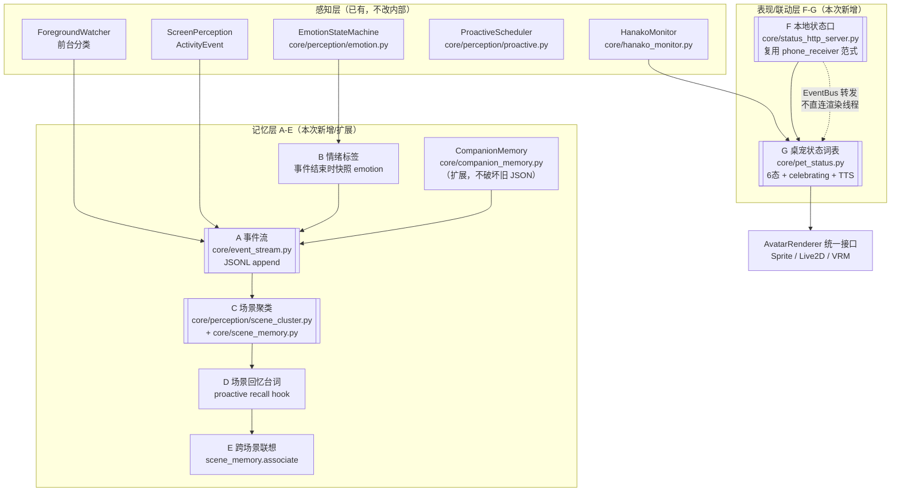
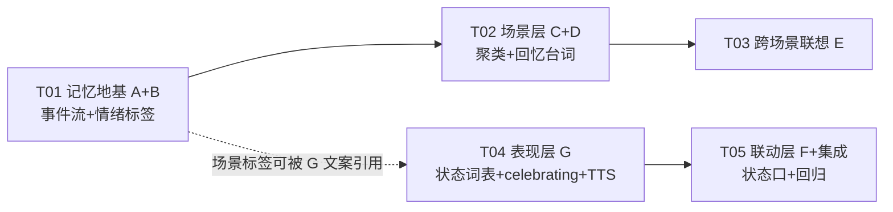

# oc-pet 升级全景 A→G 增量架构设计

> 架构师：高见远 ｜ 日期：2026-08-17 ｜ 版本：v1.0（评审稿，供工程师寇豆码照做）
> 上游输入：`docs/doudou-memory-analysis.md`（v0.2，竞品/方向分析）+ 已拍板决策（全量 A→G、庆祝态=撒花动作+现有 TTS 完工音）
> 硬约束（用户已确认）：**纯本地 / JSON·文本级 / 零新依赖（stdlib 可用）/ 每项可独立回滚 / 不新增崩溃面（0x8001010D 未根除，任何新增不得碰 Live2D 渲染线程/C 层）**

---

## 0. 代码事实核实结论（设计依据）

本次已逐文件核实以下事实，与任务书对照后**修正两处**，其余确认无误：

| 任务书说法 | 核实结果 | 对设计的影响 |
|---|---|---|
| `EmotionStateMachine` 在 `core/emotion_transitions.py` | ❌ **修正**：`EmotionStateMachine` 实际在 `core/perception/emotion.py`（线程安全，锁保护）；`core/emotion_transitions.py` 是 `TransitionEngine`（渲染层 alpha 过渡引擎，由 PetWindow QTimer 驱动） | B 的情绪快照读取点 = `PerceptionController.emotion.current`（即 `core/perception/emotion.py`） |
| `core/pet_state.py` 与 G 状态词表相关 | ⚠️ **修正**：`core/pet_state.py` 是 `PetStateManager`（**养成系统**：hunger/thirst/energy/mode=ill\|poor\|normal\|happy），与"桌宠状态词表"完全无关 | **G 新建 `core/pet_status.py`**，避免与养成 `PetStateManager` 混淆；G 状态层是"映射层"，不读养成属性 |
| `Live2DRenderer._ANIM_TO_MOTION_KW` | ✅ 确认，且**已含** `"complete": (("complete",),)`、`"login"`、`"mail"`、`"happy"` 等键 | celebrating 的 Live2D 落法优先 `complete`，模型无则回退 `happy` |
| `hanako_monitor.EVENT_TO_MOOD` | ✅ 确认：thinking_start→thinking、tool_start→working、tool_end→idle（success 分支重映射 happy/error）；**缺 celebrating** | G 在 `map_event_to_mood` 的 tool_end success 分支改为 `mood="celebrating"` |
| `PetWindow._do_hanako_state`（bubble_mixin.py:132） | ✅ 确认，**关键约束**：anim 白名单 `safe_anims=['idle','walk','extra']`，不在白名单强制 `idle` | celebrating 不能走该 anim 参数路径，需新增 `state=="celebrating"` 分支独立处理 |
| `ActivityEvent` 产出后未写入记忆 | ✅ 确认：`screen.py:513` append 到内存 `_activity_history`（上限 50 条）；`controller.generate_daily_diary` 读内存 | A 在 `screen.py` append 后 `EventBus.emit("activity_event", ...)`，PetWindow 订阅写事件流 |
| 记忆接线点 | ✅ 确认：`pet.py:659 _on_foreground_change_with_memory`（record_activity）；`chat_mixin.py:291 _record_topic`；`pet.py:2106 closeEvent`（mem.close()） | A 的写入点、C 的收盘聚类点都挂这些位置 |
| `phone_receiver.py` 范式 | ✅ 确认：HTTPServer + BaseHTTPRequestHandler 闭包、127.0.0.1:8077、X-Auth-Token、_send_json、log_message 抑制、守护线程 start/stop | F 完全复用该范式，端口改 8977 |
| `EventBus.emit` 同步、在调用方线程执行 | ✅ 确认（core/event_bus.py） | F 的 POST 写路径只 `emit` 事件；PetWindow 订阅后经 Qt 信号转主线程再驱动，**绝不直连渲染线程** |
| 帧精灵资源 | ✅ 确认：yuexinmiao 的 `pet.json` 动画序列 = idle/running-right/running-left/waving/jumping/failed/waiting/running/review；**无 celebrate 序列** | Sprite 的撒花 = 优先 `celebrate` 序列（资源存在时），否则回退 `jumping`；素材可后续补充 |

---

## 1. 总体架构

### 1.1 A-G 分层图



**分层原则**：
- **记忆层（A-E）**：把"感知→反应"直连升级为"感知→记忆→回忆"闭环；数据全部落 `~/.oc-pet/memory/`，与现有 `<agent_id>.json` 平级，互不破坏。
- **表现/联动层（F-G）**：G 是 emotion/anim **之上的语义映射层**（不推翻现有词表），F 是跨进程只读/受控写的 HTTP 口（默认关）。

### 1.2 文件清单

**新增文件（5 个，全部可独立删除回滚）**

| 相对路径 | 归属 | 说明 |
|---|---|---|
| `core/event_stream.py` | A/B | 事件流 JSONL 写入/读取/裁剪；行级损坏隔离；线程安全 |
| `core/perception/scene_cluster.py` | C | 纯函数聚类：事件流 → 场景 |
| `core/scene_memory.py` | C/D/E | 场景表 CRUD + 检索 + D 回忆台词 + E 联想 |
| `core/pet_status.py` | G | 6 态语义层：PetStatusMapper（emotion/anim 之上）→ 各渲染器映射表 + celebrating 渲染指令 |
| `core/status_http_server.py` | F | 复用 phone_receiver.py 范式：GET /pet/state 只读 + 可选 POST /pet/set-mode 白名单写 |

**修改文件（8 个，全部向后兼容、可独立回滚）**

| 相对路径 | 归属 | 改动点 |
|---|---|---|
| `core/companion_memory.py` | A/B | 扩展 `record_event()` / `read_events()` / `prune_events()`；委托 EventStream；旧字段不动 |
| `core/perception/screen.py` | A | `_activity_history.append` 后补一行 `EventBus.emit("activity_event", event=activity)` |
| `pet.py` | A/C/F | `_init_companion_memory` 注入 EventStream + emotion_provider；订阅 activity_event 写流；closeEvent 收盘聚类；F 启停 |
| `pet_mixins/chat_mixin.py` | A | `_record_topic` 追加写事件流（带 emotion 快照 + topic） |
| `core/hanako_monitor.py` | G | `map_event_to_mood` tool_end success 分支 mood `happy`→`celebrating`（emotion 仍 happy） |
| `pet_mixins/bubble_mixin.py` | G | `_do_hanako_state` 增加 `state=="celebrating"` 分支 → `_do_celebrating()`（动作+气泡+完工音） |
| `core/perception/proactive.py` | D | 注入 scene_memory；`tick()` 增加 `_try_recall`（30min 冷却 + is_disruptive 沿用） |
| `core/perception/controller.py` | C | 暴露 `rebuild_scenes(events)`（收盘调用）；供 pet.py closeEvent 调用 |
| `config.py` | D/E/F/G | 新增配置段：`memory.recall` / `memory.associate` / `celebrating` / `state_http`（均有默认值，深度合并不丢） |
| `core/perception/scenarios.py` | D | 扩展回忆型文案池 `RECALL_REACTIONS` + `get_recall_reaction()`（不改现有 SCENARIO_REACTIONS） |

### 1.3 与现有模块关系

- **不替换**：`CompanionMemory` 的 today/history/streak/last_topic 语义与接口原样保留（A 只是"并行新增"事件流）。
- **不碰**：`avatar/*` 渲染器内部（G 只走 `AvatarRenderer.play_anim/set_emotion` 统一接口，主线程调用，不新增线程）。
- **复用**：`EventBus`（A 活动事件、F 写转发）、`phone_receiver.py` 范式（F）、`scenarios.py` 文案池机制 + `is_disruptive`（D/E）、`ProactiveScheduler` 冷却/打扰/全屏守卫（D）、`TTSProvider.synthesize`（G 完工音）。
- **澄清**：`core/pet_state.py`（养成 PetStateManager）与 G 无关；`core/memory_snapshot.py`（Hanako agent 侧文本记忆）与 A-E 是两条线，A-E 不写 agent 记忆，只写桌宠本体记忆。

---

## 2. 逐项设计

### A 事件流（P0，记忆地基）

**目标**：把"感知信号（分类/场景/情绪/话题）"持续写入带时间轴的流，补齐"感知→记忆"断链。

**数据模型**：文件 `~/.oc-pet/memory/<agent_id>_events.jsonl`（与 `<agent_id>.json` 同目录平级）
- 逐行 JSON，append-only；单条损坏不影响其他行（读时逐行 try/except，坏行跳过并告警）。
- 事件字段：

```json
{"ts": 1755417600.0, "start_ts": 1755416400.0, "end_ts": 1755417600.0,
 "category": "development", "scenario": "late_night_work", "intent": "deep_work",
 "emotion": "happy", "topic": "重构事件流模块（截断60字）", "source": "foreground|vision|topic"}
```

- `ts`：事件记录时间（=end_ts 兜底）；`start_ts/end_ts`：活动起止；`category`：前台分类（development/gaming/…）；`scenario`：意图分类场景名（可空）；`intent`：意图名（可空）；`emotion`：B 的情绪快照（可空，读取时 `.get("emotion","neutral")`）；`topic`：最近对话话题（≤60 字，可选，隐私截断）；`source`：来源标记。

**接口签名（`core/event_stream.py`）**

```python
class EventStream:
    def __init__(self, agent_id: str, memory_dir: str | Path | None = None): ...
    def append(self, record: dict) -> None          # 单行 JSON append + "\n"，锁保护；异常不外抛
    def read_all(self) -> list[dict]                 # 按 ts 排序；坏行跳过
    def read_since(self, ts: float) -> list[dict]
    def read_range(self, start: float, end: float) -> list[dict]
    def prune(self, max_days: int = 30, max_entries: int = 5000) -> int   # 超限裁剪，返回删除条数
```

**CompanionMemory 扩展方法（`core/companion_memory.py`，原方法全部不动）**

```python
def record_event(self, category: str = "", scenario: str = "", intent: str = "",
                 emotion: str = "", topic: str = "", start_ts: float = 0.0,
                 end_ts: float = 0.0, source: str = "") -> None
                 # v1.1: 补 source 参数（foreground/vision/topic），默认空串向后兼容
def read_events(self, days: int = 7) -> list[dict]   # 委托 EventStream
def prune_events(self) -> int                        # 委托 EventStream.prune
```

- 构造时若传 `emotion_provider`（可调用，返回当前情绪字符串），`record_event` 的 `emotion` 为空时自动取快照（**B 的落地**）。

**接线点**：
1. `pet.py:_init_companion_memory`（635 行）→ `CompanionMemory(self._agent_id)` 后：`self._companion_memory.set_emotion_provider(lambda: self._perception.emotion.current)`（或构造参数注入）。
2. `pet.py:_on_foreground_change_with_memory`（659 行）→ `mem.record_activity(app_category)` 旁追加 `mem.record_event(category=app_category, scenario=<可空>, start_ts=<foreground 开始时间>, end_ts=time.time(), source="foreground")`。
3. `chat_mixin.py:_record_topic`（291 行）→ `mem.record_topic(text)` 旁追加 `mem.record_event(category=<当前前台分类>, topic=text, source="topic")`（emotion 由 provider 自动填）。
4. `screen.py:513`（`_activity_history.append(activity)` 后）→ `EventBus.emit("activity_event", event=activity)`；`pet.py` 订阅该事件 → `mem.record_event(category=event.category, summary 不进流, start_ts=event.start_time, end_ts=event.end_time or now, source="vision")`。无视觉 API 时此路不触发，不影响 A。

**兼容性**：事件流是**新文件**；`today/history/streak/last_topic` 语义不变；旧 `<agent_id>.json` 不丢；`yesterday_summary()` 不受影响（P2 验收"你昨天说的那个项目"照常）。

**回滚**：删除 4 处接线调用 + 不实例化 EventStream 即整体失效；已写文件保留无副作用（读取方缺省为空）。

**验收**：连续使用 3 天可导出按时间排序事件流；条目含时间/分类/情绪字段；旧记忆 JSON 兼容；append 崩溃不损坏既有行。

---

### B 情绪标签（P1，场景语义关键维度）

**目标**：让"深夜加班（焦虑）"与"深夜打游戏（开心）"可区分。

**实现**：在 A 的事件写入路径上注入 `emotion_provider`（读 `EmotionStateMachine.current` + `intensity`），事件结束时快照；`last_topic` 记录时同样带情绪。
- 快照为**纯内存读**（emotion.py 已加锁），不新增线程、不新增崩溃点。
- 事件字段 `emotion` 写入 `"happy@0.8"` 或拆两字段（推荐拆：`emotion` 存情绪名、`intensity` 存强度，读取友好）。**定案**：事件流字段为 `emotion`（名）+ `intensity`（0~1，可选）。

**接口**：`EventStream.append` 接受 `emotion`/`intensity`；`SceneMemory` 聚类时统计 `emotion_summary`（众数）。

**接线点**：同 A 的三处写入点（emotion 参数留空，由 provider 自动填）。

**兼容性**：旧事件无 emotion/intensity 字段 → 读取 `.get("emotion","neutral")`。

**回滚**：不注入 provider 即恢复无标签（A 仍工作）。

**验收**：事件流 ≥90% 条目带情绪标签；情绪读取为纯内存快照，无新增线程。

---

### C 场景聚类（P1，事件流 → 可回忆单元）

**目标**：把零散事件聚成"场景"（同 category/scenario + 时间连续性），"深夜加班/打某游戏/追剧"各自成一条场景，重复场景计数。

**接口签名（`core/perception/scene_cluster.py`，纯函数，无新依赖）**

```python
@dataclass
class Scene:
    scene_id: str          # f"{category}|{scenario or label}|{first_date}"
    label: str             # 中文标签："深夜加班" / "打游戏" ...
    category: str
    scenario: str
    tags: list[str]        # [category, scenario, period, emotion]
    first_ts: float
    last_ts: float
    count: int             # 聚合事件数（第 N 次出现的持续计数）
    duration_min: float
    emotion_summary: str   # 众数情绪
    topics: list[str]      # 该场景内话题（≤5 条，截断）

def cluster_events(events: list[dict], min_duration_min: int = 20,
                   gap_min: int = 10, day_rollover: bool = True) -> list[Scene]
```

- 规则：按 ts 排序；**同类 category/scenario + 相邻事件间隔 ≤ gap_min** 合并；合并段累计时长 ≥ min_duration_min 才成场景；跨天强制拆分（day_rollover）；同 `scene_id` 的历史场景 `count+1`（第 N 次深夜加班）。

**场景表管理（`core/scene_memory.py`）**

```python
class SceneMemory:
    def __init__(self, agent_id: str, memory_dir: str | Path | None = None): ...
    def load(self) -> None;  def save(self) -> None          # 文件损坏用空档
    def rebuild(self, events: list[dict]) -> int             # 全量重聚 + 合并旧场景计数（幂等）
    def find_matching(self, category: str, scenario: str, tags: list[str],
                      max_results: int = 3) -> list[Scene]   # D 检索
    def recent_scenes(self, n: int = 5) -> list[Scene]
    def associate(self, current: dict, scenes: list[Scene]) -> Scene | None  # E 联想
    def prune(self, max_days: int = 90, max_scenes: int = 500) -> int
```

- 文件：`~/.oc-pet/memory/<agent_id>_scenes.json`（含 `version` 字段）。

**接线点**：
1. `pet.py:closeEvent`（2198 `mem.close()` 前）→ `self._scene_memory.rebuild(events=mem.read_events(30))` + `mem.prune_events()`。
2. `controller.py` 增加透传 `rebuild_scenes(events)`（供 pet.py 调用；不主动定时，避免高频 IO）。
3. 可选增强（不做）：`generate_daily_diary` 后顺带 rebuild。

**兼容性**：场景表新文件；不存在时 `load()` 空档；不引入对旧 JSON 的写入。

**回滚**：删除 rebuild 调用 + 删除文件。

**验收**：7 天数据能聚出 ≥5 条可读场景；聚类耗时 <1s；文件 ≤几百 KB；重复场景计数正确。

---

### D 场景回忆台词（P1，把场景变成用户可感知的"回忆"）

**目标**：当前感知状态命中历史场景时，主动说一句带记忆的话；冷却 30min；沿用 `is_disruptive` 打扰判定。

**实现**：
1. `scenarios.py` 扩展**回忆型文案池**（不动现有 `SCENARIO_REACTIONS`）：

```python
RECALL_REACTIONS: dict[str, list[str]] = {
    "gaming": ["上次你打到「{topic}」那里卡了好久，这次应该过了吧？",
               "还记得上次一起玩的时候吗？这次也加油！"],
    "late_night_work": ["上次也是这个点还在忙，今天也要注意休息哦。",
                        "上次深夜加班后你聊到「{topic}」，后来有进展吗？"],
    "video_watching": ["上次你追的那部剧，后来看到结局了吗？"],
    "development": ["上次你说「{topic}」，现在完成了吗？"],
    ...
}
def get_recall_reaction(scene: Scene, extra: dict = None) -> str | None
```

2. `proactive.py` 增加 hook（注入 `scene_memory`，未注入则整体失效、行为不变）：

```python
def set_scene_memory(self, scene_memory) -> None
def _try_recall(self, now: float, signals: dict) -> str | None:
    # 独立冷却 _recall_cooldown_until（30min，默认 30*60）
    # 复用 tick 已有守卫：daily_limit / fullscreen / typing 抑制
    # 命中：scene = self._scene_memory.find_matching(category, scenario, tags)[0]
    #       文案 = get_recall_reaction(scene, {"topic": scene.topics[0] if scene.topics else ""})
    # 打字中且场景非值得打扰（is_disruptive）→ return None
    # 触发后 _record_proactive_trigger(now)（共用每日上限与冷却簿记）
```

3. `ProactiveScheduler.tick()` 内调用顺序：`_try_intent`（意图优先）→ `_try_recall`（回忆）→ 规则引擎兜底。回忆**不抢**意图的触发机会（意图命中则回忆让位）。

**接线点**：`pet.py` 初始化处（`self._proactive` 创建后，v1.1 按实现核对修正：PetWindow 自持 `self._proactive` 实例并驱动 `tick()`，`self._perception.proactive` 恒为 None，因此注入目标是 `self._proactive`）→ `self._proactive.set_scene_memory(self._scene_memory)`；controller 只做收盘 rebuild 透传；config 段 `memory.recall.enabled=True/cooldown_minutes=30`。

**兼容性**：未注入 scene_memory / 开关关闭 → `_try_recall` 直接 return None，现有主动对话路径零变化。

**回滚**：开关关闭或删除 hook 调用。

**验收**：同一场景第二次出现能触发 ≥1 条带记忆台词；冷却 30min 生效；与现有主动对话经同一调度不冲突（不重复触发）。

---

### E 跨场景联想（P2，规则版，可开关）

**目标**：不做向量，用"情绪/主题标签"交集做跨场景关联：如"上次深夜加班后聊过 X"→ 下次深夜加班时提一句；游戏偏好→看剧推荐。

**实现**（`scene_memory.associate` + 模板）：

```python
def associate(self, current: dict, scenes: list[Scene]) -> Scene | None:
    # current: {"category", "scenario", "emotion", "period"}
    # 1. 候选 = 与 current 有标签交集的场景（tag 交集 ≥1：emotion 相同 or period 相同 or category 相邻）
    # 2. 排除同 scene_id 直匹配（那是 D 的活）
    # 3. 取最近一条 → 返回（调用方用 RECALL_REACTIONS 通用模板出文案）
```

- 文案模板（并入 RECALL_REACTIONS 或独立 `ASSOCIATE_REACTIONS`）："上次也是这样的时候，你好像提过「X」…"。
- 开关：config `memory.associate.enabled`（默认 True；误触发率高可关）。

**接线点**：`_try_recall` 未命中且 `memory.associate.enabled` → `self._scene_memory.associate(...)`。

**兼容性/回滚**：开关关闭即零行为。

**验收**：产出 ≥1 个真实可用的跨场景联想案例；误触发率低（保守规则 + 可配置关闭）。

---

### G 桌宠状态词表 + celebrating + TTS（P1，重点：双形态兼容）

> 回答用户三个问题：
> 1. **G 不只是 6 种状态**——它定义统一"桌宠状态"语义层（idle/working/review/waiting/failed/celebrating），是 emotion/anim **之上的映射层**，不推翻现有词表（EXPRESSION_MAP / _ANIM_TO_MOTION_KW / hanako mood 全保留）；
> 2. 每状态 → 各渲染器的「anim + emotion」组合（Sprite 走帧序列、Live2D 走 motion+表情、VRM 占位降级仅表情/文案），**通过 AvatarRenderer 统一接口实现，不碰渲染器内部**；
> 3. celebrating 的 TTS 走现有 `tts_provider/api_tts.py` 管道（完工音）。

**状态语义层（`core/pet_status.py`）**

```python
PET_STATES = ("idle", "working", "review", "waiting", "failed", "celebrating")

class PetStatusMapper:
    # 状态 → 各渲染器 (anim, emotion)
    STATE_TO_SPRITE = {
        "idle":        ("idle",    "neutral"),
        "working":     ("review",  "working"),
        "review":      ("waiting", "thinking"),
        "waiting":     ("waiting", "neutral"),
        "failed":      ("failed",  "sad"),
        "celebrating": ("celebrate", "happy"),   # 序列不存在时回退 "jumping"
    }
    STATE_TO_LIVE2D = {
        "idle":        ("idle",      "neutral"),
        "working":     ("working",   "neutral"),
        "review":      ("thinking",  "thinking"),
        "waiting":     ("idle",      "neutral"),
        "failed":      ("failed",    "sad"),
        "celebrating": ("complete",  "happy"),   # 模型无 complete motion 时回退 "happy"
    }
    # VRM：占位降级，仅表情 + 文案，不播动画
    STATE_TO_VRM = {
        "idle":        ("idle",  "neutral"), "working": ("idle", "neutral"),
        "review":      ("idle",  "thinking"), "waiting": ("idle", "neutral"),
        "failed":      ("idle",  "sad"),
        "celebrating": ("idle",  "happy"),
    }

    def render_for(self, state: str, renderer) -> None:
        """通过 AvatarRenderer 统一接口下发（主线程调用，不新增线程）。

        分派顺序（v1.1 按实现核对修正）：
        1. 先判 `_model` → Live2D（唯一可靠判据：Live2DRenderer 独有，加载后为
           live2d.v3.Model 实例；注意 Live2D 与 VRM **都**有 `_frames` 兼容属性，
           不能先判 `_frames`，否则 Live2D/VRM 会被误判成 Sprite）；
        2. 再判 `unsupported` → VRM（VRMRenderer.load 失败时置 True）；
        3. 其余 → Sprite（帧精灵）。
        """
        if hasattr(renderer, "_model"):         # Live2DRenderer
            anim, emo = self.STATE_TO_LIVE2D.get(state, ("idle", "neutral"))
            renderer.play_anim(anim, emotion=emo)   # play_anim 内部按 _ANIM_TO_MOTION_KW 匹配 motion
            renderer.set_emotion(emo)
        elif getattr(renderer, "unsupported", False):   # VRMRenderer（占位）
            _, emo = self.STATE_TO_VRM.get(state, ("idle", "neutral"))
            renderer.set_emotion(emo)           # 只记录状态，不崩溃
        else:                                   # SpriteRenderer（帧精灵）
            anim, emo = self.STATE_TO_SPRITE.get(state, ("idle", "neutral"))
            if state == "celebrating" and anim not in renderer._frames:
                anim = "jumping" if "jumping" in renderer._frames else "waving"
            renderer.play_anim(anim, emotion=emo)
            renderer.set_emotion(emo)

    def current(self) -> str: ...               # 当前状态（供 F 只读口输出）
    def set_state(self, state: str) -> None: ...  # 记录 + 可选回调
```

**celebrating 触发链路（重点）**

1. `hanako_monitor.map_event_to_mood`（tool_end 分支）：
   - `success=True` → `mood="celebrating"`, `message="完成啦"`, `emotion="happy"`（原为 mood="happy"，**行为升级点**）；
   - `success=False` → 维持 `mood="error"/emotion="angry"`（→ 状态层 failed）。
2. `HanakoMonitor.push_event` → `_set_if_changed(anim, message, emotion, state=mood)` → `on_state_change` → `PetWindow._on_hanako_state`（信号）→ `_do_hanako_state`。
3. `bubble_mixin._do_hanako_state`（132 行）**新增分支**（在 safe_anims 收窄**之前**）：

```python
if state == "celebrating":
    self._do_celebrating()
    return
```

4. `_do_celebrating()`（PetWindow 主线程，新增方法，建议放 behavior_mixin 或 pet.py）：

```python
def _do_celebrating(self):
    # 1. 双形态撒花动作（统一接口，不碰渲染线程/C 层）
    try:
        self._status_mapper.render_for("celebrating", self._renderer)
    except Exception:
        pass
    # 2. 情绪/表情脸（3s 过期，复用现有机制）
    self._set_surface_emotion("happy", duration_ms=3000, source="celebrating")
    # 3. 气泡（可选，完工反馈）
    self._show_bubble("完成啦！", emotion="happy")
    # 4. TTS 完工音：走现有 tts_provider/api_tts.py 管道，非阻塞（不阻塞主流程）
    if self.config.get("celebrating", {}).get("tts_enabled", True) and self._tts_enabled():
        threading.Thread(target=self._synth_celebration_tts, daemon=True).start()
    # 5. 3s 后回 idle（复用 _pet_revert_timer 或 _emotion_expiry_timer）
    self._pet_revert_timer.start(3000)
```

```python
def _synth_celebration_tts(self):
    """后台线程：合成完工音 → 信号回主线程播放（绝不直接碰 Qt/渲染）。"""
    try:
        provider = getattr(self._engine, "_tts_provider", None) or getattr(self, "_tts_provider", None)
        if provider is None:
            return
        audio = provider.synthesize("完成啦！", character_id=self._current_char)
        if audio and os.path.exists(audio):
            self.tts_celebration_signal.emit(audio)   # 新增 Signal，Qt 自动转主线程
    except Exception:
        pass
```

- `_tts_enabled()` = `self.config.get("tts", {}).get("enabled", True)` 且 `celebrating.enabled`。
- 若 Hanako 回复本身已带 `audio_path`（LLM 完工语音），`_do_hanako_state` 现有 TTS 播放逻辑已覆盖——celebrating 分支只负责"本地完工音 + 撒花"，二者不冲突。

**双形态兼容性总结表（用户问题的直接回答）**

| 状态 | Sprite（Q6 帧精灵） | Live2D | VRM（占位） |
|---|---|---|---|
| idle | anim=idle / emotion=neutral | motion=idle / 表情 neutral | 仅表情 neutral |
| working | anim=review（EXPRESSION_MAP working→review）| motion=working（main_3）/ 表情 neutral | 仅表情 neutral |
| review | anim=waiting（thinking→waiting）| motion=thinking（main_3）/ 表情 thinking | 仅表情 thinking |
| waiting | anim=waiting / neutral | motion=idle / neutral | 仅表情 neutral |
| failed | anim=failed（sad→failed）| motion=failed（mission）/ 表情 sad | 仅表情 sad |
| **celebrating** | **anim=celebrate（无则 jumping→waving 回退）+ emotion=happy（撒花）** | **motion=complete（无则 happy 回退）+ 表情 happy** | **仅表情 happy + 气泡"完成啦！"** |

**兼容性**：
- 现有词表（EXPRESSION_MAP / _ANIM_TO_MOTION_KW / hanako mood）**全部保留**；celebrating 是新增状态键，不替换 happy。
- `_do_hanako_state` 的 safe_anims 收窄逻辑不受影响（celebrating 分支在收窄之前 return）。
- tool_end success 从 "happy" 变为 "celebrating" 是**唯一行为变化**，由 `celebrating.enabled`（默认 True）控制；关掉即恢复旧行为。
- `_update_status_indicator(state)` 需容忍未知状态（加 `"celebrating": "🎉 完成"` 标签，缺失时显示原样）。

**回滚**：`config.celebrating.enabled=False`；或删 `_do_hanako_state` 分支 + `map_event_to_mood` 改动还原。

**验收**：hanako `tool_end` 成功 → celebrating（Sprite 撒花帧/Live2D complete motion + 完工音）；两种形态都生效；VRM 占位不崩；TTS 合成不阻塞主流程；3s 后回 idle。

---

### F 本地状态口（P2，默认关，复用 phone_receiver.py 范式）

**目标**：任意外部程序（构建脚本/游戏/自动化/另一只桌宠）可查询桌宠状态；写仅白名单、经事件总线转发、不直连渲染线程。

**接口签名（`core/status_http_server.py`）**

```python
class PetStatusHTTPServer:
    def __init__(self, state_provider: callable, auth_token: str = "",
                 port: int = 8977): ...
    def start(self) -> None      # 守护线程（复用 PhoneActivityReceiver 模式）
    def stop(self) -> None

# 路由（复用 phone_receiver._make_handler 闭包范式 + X-Auth-Token + _send_json + log_message 抑制）
# GET  /pet/state      -> {"state": <6态>, "emotion": ..., "anim": ...,
#                          "scenario": ..., "agent_id": ..., "renderer_format": "sprite|live2d|vrm",
#                          "celebrating_active": bool, "ts": ...}
# GET  /pet/health     -> {"ok": True}
# POST /pet/set-mode   -> body {"mode": "celebrating"}；白名单校验 → EventBus.emit("pet_set_mode", mode=...)
#                          → 200；白名单外 → 400；未开启写 → 403
```

**白名单词汇（写，只写不读渲染线程）**：`celebrating / idle / working / review / waiting / failed / happy / thinking / sad / surprised`。经 `EventBus.emit("pet_set_mode", mode=...)` 转发；`pet.py` 订阅后（信号转主线程）→ `_status_mapper.set_state(mode)` + `render_for`。**事件总线转发 = 不直连渲染线程**（EventBus.emit 在 HTTP 线程同步执行，但 handler 只做状态登记/信号发射，Qt 对象操作由信号转到主线程）。

**配置（`config.py` 新增段，默认关）**

```json
"state_http": {"enabled": false, "port": 8977, "auth_token": "", "allow_set_mode": false}
```

**接线点**：`pet.py` 初始化时 `if self.config.get("state_http", {}).get("enabled"): self._status_http = PetStatusHTTPServer(state_provider=self._status_snapshot, ...); self._status_http.start()`；`closeEvent` 中 `stop()`。`_status_snapshot()` 由 PetWindow 提供（读 `_status_mapper.current()` / `_current_emotion` / `_renderer` 类型 / scenario）。

**兼容性**：默认关 → 零行为变化；不占端口。

**回滚**：关 config 或删启动调用。

**验收**：默认关闭；127.0.0.1:8977；GET 返回 emotion/scenario/status；写白名单校验（非法 400、未开启 403）；POST 经事件总线不直连渲染线程；可整体回滚。

---

## 3. 依赖与顺序

### 3.1 依赖图



- A→B→C→D→E 为记忆层地基到体验的渐进路径（B 是 A 的字段增强，C 依赖 A+B 数据，D 依赖 C 场景表，E 依赖 C/D）。
- **G 独立**（不依赖记忆层，可并行开发）。
- **F 依赖 G**（GET /pet/state 输出 6 态词表）+ phone_receiver.py 范式（已有）。

### 3.2 实现顺序建议

| 梯队 | 任务 | 说明 |
|---|---|---|
| 第一梯队 | T01 → T02 | 记忆地基（P0-P1） |
| 第二梯队（可与第一梯队并行） | T04 | 表现层小步（P1，独立） |
| 第三梯队 | T03 → T05 | 联想（P2）+ 联动口（P2，依赖 T04 词表） |

---

## 4. 风险与待明确事项

| # | 风险/待明确 | 影响 | 设计默认 | 备注 |
|---|---|---|---|---|
| 1 | **事件流文件膨胀** | 长期运行 JSONL 增长 | 上限 30 天 / 5000 条，`prune()` 收盘裁剪 | 竞品文档问题 5 |
| 2 | **F 白名单词汇表** | 写能力边界 | 9 词白名单 + `allow_set_mode=False` 默认只读 | 竞品文档问题 8；可后续扩 |
| 3 | **TTS 完工音是否阻塞主流程** | 主线程卡顿风险 | **不阻塞**：合成在后台线程、播放异步；tts 禁用时仅动作 | 已拍板"现有 TTS 完工音" |
| 4 | **ActivityEvent 依赖视觉 API（可选）** | 无视觉 API 时事件流稀疏 | 事件流主力 = 前台切换 + topic + emotion，足够场景聚类；视觉 summary 不进流（隐私） | 竞品文档问题 3：**定案只走本地信号** |
| 5 | **tool_end success 行为变化**（happy→celebrating） | 状态指示器/依赖 happy 的旧逻辑 | `celebrating.enabled=True` 可关；状态指示器容忍未知状态 | 需回归 status_hud |
| 6 | **topic 隐私** | 用户原话入库 | 沿用 60 字截断 + 敏感词黑名单（复用 screen.py `_is_screen_blacklisted` 思路） | 竞品文档问题 6：**建议采纳黑名单**，需产品确认词表 |
| 7 | **D/E 文案生硬** | 体验 | 冷却可调、联想可关；文案池可扩充 | 竞品文档问题 4：**沿用 is_disruptive + 冷却，暂不做浓度调节** |
| 8 | **Live2D 卡手势防御** | celebrating 播 complete 卡死风险 | 复用 `GESTURE_TIMEOUT`（3s 强制回 idle）+ `_pet_revert_timer` | 现有防御已覆盖 |

---

## 5. 结构化任务列表（供工程师寇豆码直接照做）

> 规则：≤5 个任务、按功能模块分组、每个任务 ≥3 个文件、T01 为项目基础设施（本设计语境 = 记忆地基 + 配置接线）。

### T01 记忆地基（A + B）：事件流 + 情绪标签
- **Source Files**：`core/event_stream.py`（新）、`core/companion_memory.py`（改）、`pet.py`（改：_init_companion_memory 注入 provider + _on_foreground_change_with_memory 接线 + 订阅 activity_event）、`pet_mixins/chat_mixin.py`（改：_record_topic 接线）、`core/perception/screen.py`（改：append 后 emit）、`config.py`（改：memory 段）
- **Dependencies**：无
- **Priority**：P0
- **验收标准**：
  1. `~/.oc-pet/memory/<agent_id>_events.jsonl` 出现事件流，字段含 ts/start_ts/end_ts/category/scenario/emotion/intensity/topic
  2. 单行 append，手动损坏一行后 read 不崩、其余行可读
  3. 旧 `<agent_id>.json` 兼容不丢；`yesterday_summary()` 行为不变
  4. ≥90% 条目带情绪标签（emotion_provider 生效）
  5. `prune(max_days=30, max_entries=5000)` 生效

### T02 场景层（C + D）：场景聚类 + 场景回忆台词
- **Source Files**：`core/perception/scene_cluster.py`（新）、`core/scene_memory.py`（新）、`core/perception/scenarios.py`（改：RECALL_REACTIONS + get_recall_reaction）、`core/perception/proactive.py`（改：_try_recall + set_scene_memory）、`core/perception/controller.py`（改：rebuild_scenes 透传）、`pet.py`（改：closeEvent 收盘 rebuild + proactive 注入 scene_memory）
- **Dependencies**：T01
- **Priority**：P1
- **验收标准**：
  1. 7 天事件流能聚出 ≥5 条可读场景；聚类 <1s；场景表 ≤几百 KB
  2. 同一场景第二次出现能触发 ≥1 条带记忆台词（含 topic 拼接）
  3. 回忆冷却 30min 生效；打字中且非值得打扰不触发；与意图触发不冲突
  4. 未注入 scene_memory 或 `memory.recall.enabled=False` 时零行为变化

### T03 跨场景联想（E）
- **Source Files**：`core/scene_memory.py`（改：associate）、`core/perception/scenarios.py`（改：ASSOCIATE_REACTIONS）、`core/perception/proactive.py`（改：_try_recall 未命中时调 associate）、`config.py`（改：memory.associate.enabled）
- **Dependencies**：T02
- **Priority**：P2
- **验收标准**：
  1. 产出 ≥1 个真实可用跨场景联想案例（情绪/主题标签交集）
  2. `memory.associate.enabled=False` 时零行为；误触发率低

### T04 表现层（G）：6 态词表 + celebrating + 完工音（双形态）
- **Source Files**：`core/pet_status.py`（新：PetStatusMapper + STATE_TO_SPRITE/LIVE2D/VRM + render_for）、`core/hanako_monitor.py`（改：tool_end success → mood=celebrating）、`pet_mixins/bubble_mixin.py`（改：_do_hanako_state celebrating 分支 + _do_celebrating + _synth_celebration_tts + 新增 Signal）、`config.py`（改：celebrating 段）
- **Dependencies**：无（可与 T01/T02 并行）
- **Priority**：P1
- **验收标准**：
  1. hanako `tool_end` 成功 → celebrating（Sprite 撒花帧/Live2D complete motion + 完工音）；两种形态都生效
  2. VRM 占位不崩（仅表情/气泡降级）
  3. 完工音走 tts_provider/api_tts.py 管道、后台合成、不阻塞主流程；tts 禁用时仅动作
  4. `celebrating.enabled=False` 恢复旧 happy 行为；3s 后回 idle；不新增渲染线程

### T05 联动层（F）+ 集成回归
- **Source Files**：`core/status_http_server.py`（新：复用 phone_receiver 范式）、`config.py`（改：state_http 段）、`pet.py`（改：F 启停 + _status_snapshot + 订阅 pet_set_mode）、`docs/upgrade-a-g-design.md`（更新）
- **Dependencies**：T04（需要 6 态词表）
- **Priority**：P2
- **验收标准**：
  1. 默认关闭；127.0.0.1:8977；GET /pet/state 返回 6 态 + emotion + scenario + renderer_format
  2. POST /pet/set-mode 白名单校验（非法 400、未开启写 403）；经 EventBus 转发不直连渲染线程
  3. 全量 A-G 集成回归：旧 JSON/旧行为兼容；每项可独立回滚（逐项开关验证）
  4. 无新依赖、无新线程触碰 Live2D 渲染线程/C 层

---

## 附：设计原则回执

- **Simplicity**：A-G 全部 stdlib + JSON，事件流/场景表均为 append/整写 + 损坏隔离，无队列/无 DB。
- **Modularity**：新增 5 文件均单职责；对现有模块只做"旁路追加"，不侵入既有控制流。
- **Testability**：`scene_cluster.py` 为纯函数可直接单测；`PetStatusMapper.render_for` 可注入 fake renderer 单测；EventStream 可用临时目录单测。
- **回滚性**：A-G 每项都有 config 开关或删除接线即回滚，不互相牵连。

---

## 附：实现核对与偏差记录（v1.1，2026-08-17）

> 工程师寇豆码按 v1.0 实现 T01-T05（281 测试通过）。QA 独立回归后，以下 4 处偏差经架构师复核确认，本文档 v1.1 已同步修正正文（G 分派、D 注入点、A 签名）。

| # | 偏差 | 设计 v1.0 原文 | 实现/代码事实 | 架构师结论 |
|---|---|---|---|---|
| 1 | **render_for 分派顺序** | 先判 `_frames`（Sprite）再判 `_model`（Live2D） | `Live2DRenderer.__init__` 有 `_frames: dict = {}`（live2d_renderer.py:103，兼容属性）；`VRMRenderer` 也有 `_frames`（vrm_renderer.py:48）。先判 `_frames` 会把 Live2D/VRM 误判为 Sprite | ✅ **工程师修正正确**：改为先判 `_model`（Live2D 独有可靠判据）→ 再判 `unsupported`（VRM）→ else Sprite；已加单测 `test_mapper_live2d_dispatch` 锁定。v1.1 正文已按此更新（含 VRM 判别补强） |
| 2 | **proactive 注入点** | `self._perception.proactive.set_scene_memory(...)` | `pet.py:263` 为 `self._proactive = ProactiveScheduler(...)`（PetWindow 自持实例并驱动 tick）；`PerceptionController._proactive` 初始为 None，且 PetWindow 从不调用 `_perception.set_proactive()` → `_perception.proactive` 恒 None | ✅ **工程师修正正确**：注入 `self._proactive`；controller 只做收盘 rebuild 透传。v1.1 正文已更新 |
| 3 | **record_event source 参数** | 签名未列 `source`（接线文字用了 foreground/vision/topic） | 实现为 `record_event(..., source: str = "")`，默认空串向后兼容 | ✅ **接受**：签名补全，语义与接线一致。v1.1 正文签名已更新 |
| 4 | **文档未同步实现** | v1.0 文档未含实现核对 | 工程师未改权威文档 | ✅ **本节约 4 处偏差已补记**；v1.0 正文相关段落同步修正，文档保持权威基准 |

**最终代码事实（锁定，后续实现以此为基准）**：
- `PetStatusMapper.render_for` 分派：`hasattr(renderer, "_model")` → Live2D；`getattr(renderer, "unsupported", False)` → VRM；else → Sprite。
- 回忆注入：`PetWindow._proactive.set_scene_memory(scene_memory)`（PetWindow 侧），非 `_perception.proactive`。
- `CompanionMemory.record_event(..., source="foreground|vision|topic")` 已实现。

